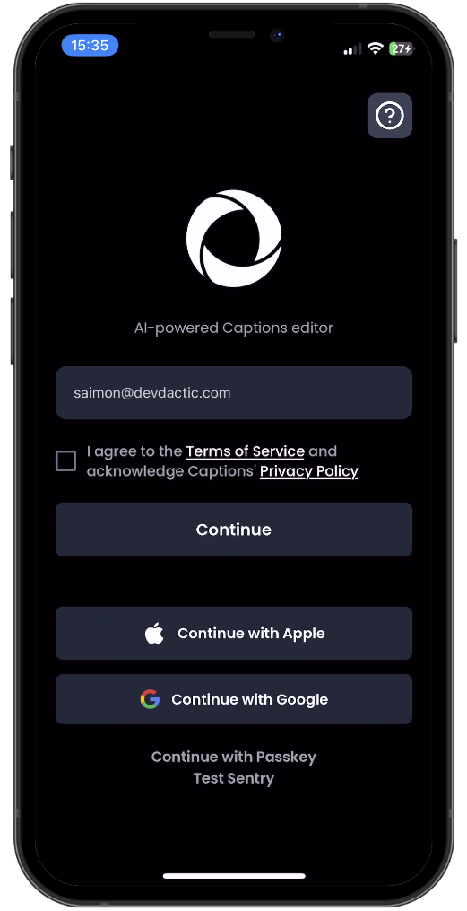
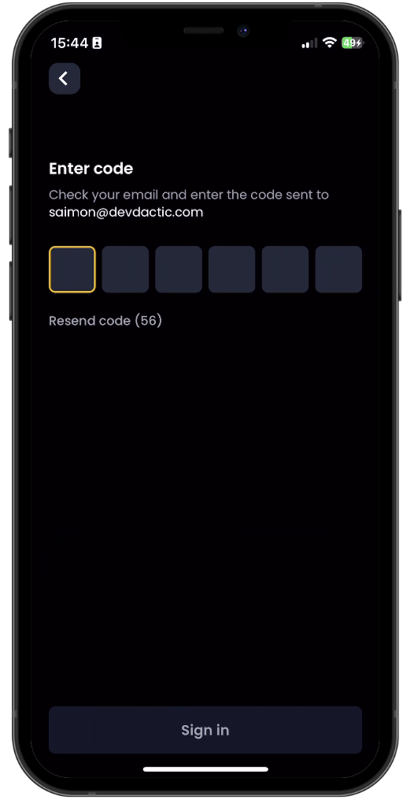
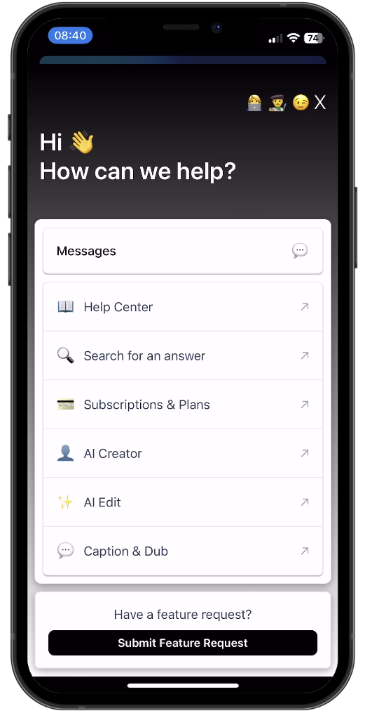
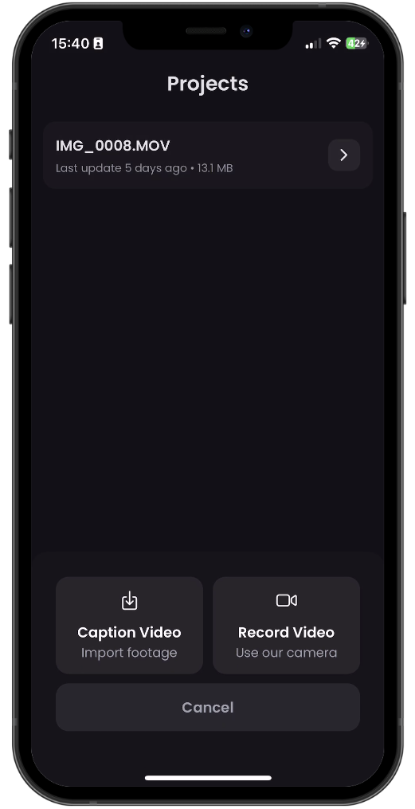
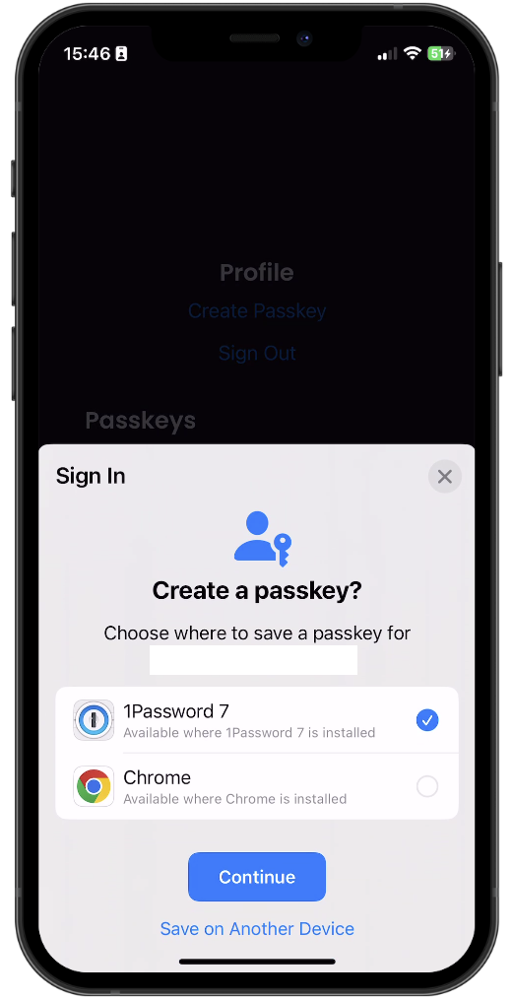
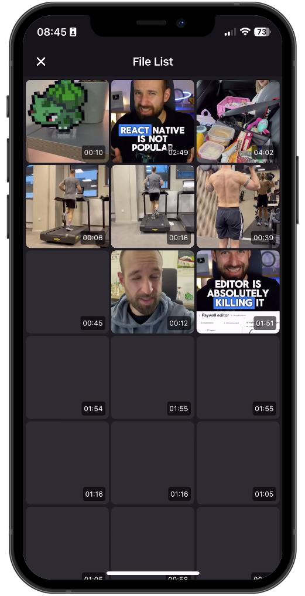
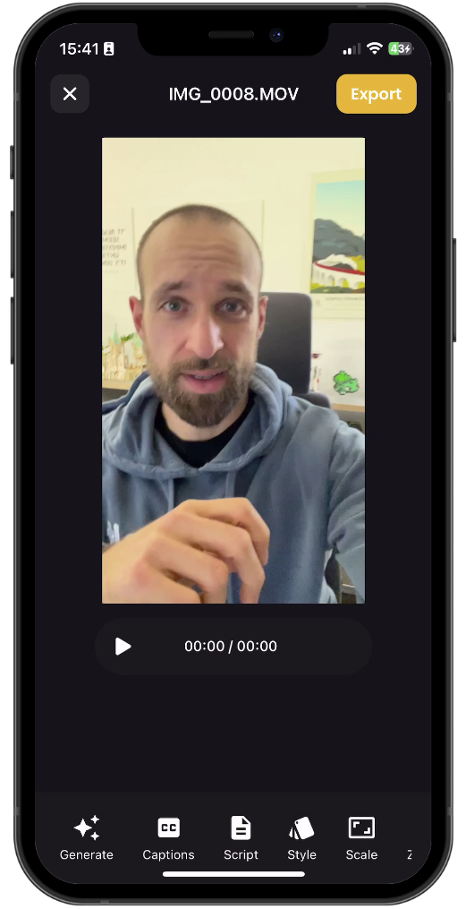
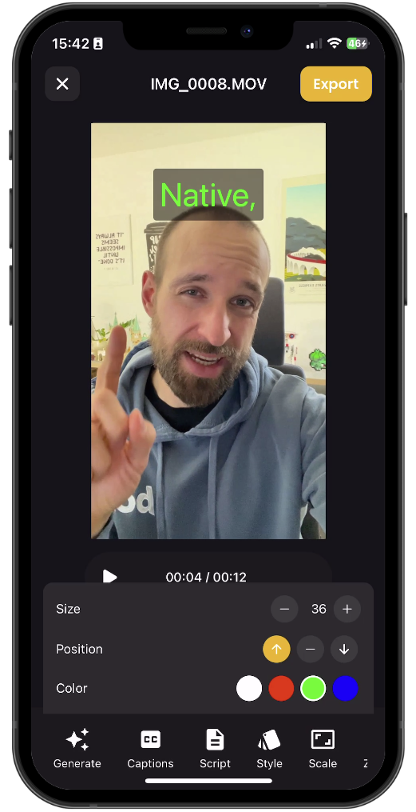
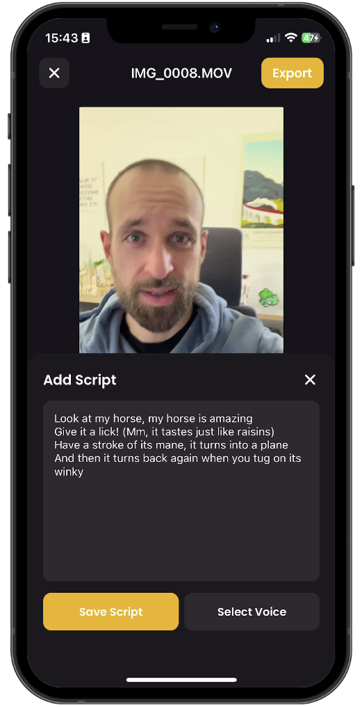

# AI caption editor
[Reference - Thanks to Simon Grimm for Such a Nice and Elaborated Project, Do Check out his channel on YT for more such projects.](https://github.com/Galaxies-dev/ai-caption-editor-react-native/tree/main?tab=readme-ov-file)

## App Architecture and Expo Prebuild

### Expo Setup
- npx rn-new --nativewind -> expo with nativewind
OR
- npx create-expo-app@latest -> expo SDK 53 without nativewind
- npm run reset-project

- create a top level src folder add app folder inside that, create componenet and all other folders inside this src folder.
- change the tsconfig.json
- change app.json

```json
"baseUrl":".",
"@/*":[
    "src/*"
],
"~/*": ["./*"],
"@/convex/*":["convex/*"]

// update paths to direct to src we created
"icon":"./src/..."

"plugins":[
    ...,
    "newArchitecture": true // file-based routing
    // replace expo-build-properties
    [
        "expo-build-properties",
        {
            "ios": {
                "deploymentTarget": "15.1"
            }
        }
    ],
    [
        "expo-media-library",
        {
        "photosPermission": "Allow $(PRODUCT_NAME) to access your photos.",
        "savePhotosPermission": "Allow $(PRODUCT_NAME) to save photos.",
        "isAccessMediaLocationEnabled": true,
        "granularPermissions": ["audio", "photo"]
        }
    ]


]
```


#### Expo SDKs 
- npx expo install expo-dev-client
- npx expo install @expo-google-fonts/poppins expo-font
- npx expo install expo-checkbox
- npx expo install expo-build-properties
- npx expo install expo-image-picker
- npx expo install expo-media-library
- npx expo install expo-video
- npx expo install expo-audio 
- npx expo install expo-linear-gradient

- npm i date-fns

#### Folder structure
- () are logical grouping and hidden in url
- src/app/index.tsx -> /
- src/app/(app)/(public)/login.tsx -> /login

```text
src/
├── app/
│ ├── (app)/
│ │ ├── (authenticated)/
│ │ │ ├── (modal)/
│ │ │ │ ├── project/
│ │ │ │ │ └── [id].tsx
│ │ │ │ ├── create.tsx
│ │ │ │ └── filelist.tsx
│ │ │ ├── (tabs)/
│ │ │ │ ├── _layout.tsx
│ │ │ │ ├── create.tsx
│ │ │ │ ├── profile.tsx
│ │ │ │ └── project.tsx
│ │ │ └── _layout.tsx
│ │ ├── (public)/
│ │ │ ├── _layout.tsx
│ │ │ ├── login.tsx
│ │ │ └── verify.tsx
│ │ └── _layout.tsx
│ ├── _layout.tsx
│ └── index.tsx
│
├── assets/
│ └── ... (images, fonts, etc.)
│
├── components/
│ └── ... (reusable UI components)
│
├── mocks/
│ └── ... (mock API data or handlers)
│
├── store/
│ └── ... (state management files)
│
└── utils/
└── ... (helper functions)
```

### Native Wind Setup
- npm install nativewind 
- npm install --dev tailwindcss@^3.4.17

- npx tailwindcss init
- npx expo customize babel.config.js
- npx expo customize metro.config.js

```js
// tailwind.config.js

/** @type {import('tailwindcss').Config} */
module.exports = {
    // NOTE: Update this to include the paths to all files that contain Nativewind classes.
    content: ["./src/**/*.{js,jsx,ts,tsx}"],
    presets: [require("nativewind/preset")],
    theme: {
        extend: {
            colors:{
                primary: '#F3B01C',
                dark: '#131417'
            },
            fontFamily:{
                Poppins_400Regular: ['Poppins_400Regular'],
                Poppins_500Medium: ['Poppins_500Medium'],
                Poppins_600SemiBold: ['Poppins_600SemiBold'],
                Poppins_700Bold: ['Poppins_700Bold'],
            }
        },
    },
    plugins: [],
}

// babel.config.js
module.exports = function (api) {
  api.cache(true);
  return {
    presets: [
      ["babel-preset-expo", { jsxImportSource: "nativewind", unstable_transformImportMeta: true }],
      "nativewind/babel",
    ],
  };
};

// metro.config.js
const { withNativeWind } = require('nativewind/metro');
const {
  getSentryExpoConfig
} = require("@sentry/react-native/metro");

const config = getSentryExpoConfig(__dirname);

module.exports = withNativeWind(config, { input: './src/global.css' });

```
- create nativewind-env.d.ts
```ts
/// <reference types="nativewind/types" />

```

- create src/global.css

```css
/* global.css */
@tailwind base;
@tailwind components;
@tailwind utilities;css

```
- import global.css in the _layout.tsx file -> import '@/global.css'

- npx expo prebuild -> creates android and ios folder
- npx expo run:android -> build & run the andoid app using the generated native project

- No need to run npx expo start-> Start Metro bundler (JS only, managed workflow)

### Clerk Expo Setup
- npm install @clerk/clerk-expo expo-secure-store
- npm install @clerk/expo-passkeys

- login to clerk and create a project


### Jotai Setup
- npm install jotai

#### Setting up jotai store

```ts
// src/store/login.ts
import { atom } from 'jotai';

export const emailAtom = atom('');

//usage
import { emailAtom } from '@store/login'
import { useSetAtom } from 'jotai'
const setEmailAtom = useSetAtom(emailAtom)
```


### Setting up Convex & DB Schema
- npm i convex
- npm i @clerk/backend
- npx convex dev

- A project will be create inside the convex.

### Setting up Sentry(Error Management and Performance Monitoring)
- login to sentry -> create a new project react-native
- npx @sentry/wizard@latest -i reactNative

### Using Google Fonts in expo and Convex, Clerk in root layout
```tsx
// _layout.tsx
// Fonts
import {
  useFonts,
  Poppins_400Regular,
  Poppins_500Medium,
  Poppins_600SemiBold,
  Poppins_700Bold,
} from '@expo-google-fonts/poppins';

// Convex
import { ConvexReactClient } from 'convex/react';
import { ConvexProviderWithClerk } from 'convex/react-clerk';

// Clerk
import { ClerkProvider, ClerkLoaded, useAuth, useUser } from '@clerk/clerk-expo';
import { tokenCache } from '@clerk/clerk-expo/token-cache'
import { passkeys } from '@clerk/clerk-expo/passkeys';


// Expo related
import '@/global.css';
import { Slot, SplashScreen } from 'expo-router';
import { useEffect } from 'react';
import {LogBox, useColorScheme } from 'react-native';
import { DefaultTheme, ThemeProvider, DarkTheme } from '@react-navigation/native';
import { GestureHandlerRootView } from 'react-native-gesture-handler';

// Sentry
import * as Sentry from '@sentry/react-native';

Sentry.init({
  dsn: process.env.EXPO_PUBLIC_SENTRY_DSN,
  // Configure Session Replay
  replaysSessionSampleRate: 1.0,
  replaysOnErrorSampleRate: 1.0,
  integrations: [Sentry.mobileReplayIntegration()],

  // uncomment the line below to enable Spotlight (https://spotlightjs.com)
  // spotlight: __DEV__,
});


// Splash screen to wait for google fonts to load
SplashScreen.preventAutoHideAsync();

// Clerk
const publishableKey = process.env.EXPO_PUBLIC_CLERK_PUBLISHABLE_KEY!;

if (!publishableKey) {
  throw new Error(
    'Missing Publishable Key. Please set EXPO_PUBLIC_CLERK_PUBLISHABLE_KEY in your .env'
  );
}
LogBox.ignoreLogs(['Clerk: Clerk has been loaded with development keys.']);

// Convex
const convex = new ConvexReactClient(process.env.EXPO_PUBLIC_CONVEX_URL!, {
  unsavedChangesWarning: false,
});

const InitialLayout = () => {
// Clerk
const user = useUser();

// Google Fonts with splash screen
  const [fontsLoaded] = useFonts({
    Poppins_400Regular,
    Poppins_500Medium,
    Poppins_600SemiBold,
    Poppins_700Bold,
  });

  useEffect(() => {
    if (fontsLoaded) {
      SplashScreen.hideAsync();
    }
  }, [fontsLoaded]);

  useEffect(() => {
    if (user && user.user) {
      Sentry.setUser({ email: user.user.emailAddresses[0].emailAddress, id: user.user.id });
    } else {
      Sentry.setUser(null);
    }
  }, [user]);

  if (!fontsLoaded) {
    return null;
  }

  return <Slot />;
};

const RootLayout = () => {
  const colorScheme = useColorScheme();
  return (
     <ClerkProvider
      publishableKey={publishableKey!}
      __experimental_passkeys={passkeys} tokenCache={tokenCache}>
        <ClerkLoaded>
            <ConvexProviderWithClerk client={convex} useAuth={useAuth}>
                <GestureHandlerRootView style={{ flex: 1 }}>
                    <ThemeProvider value={colorScheme === 'dark' ? DarkTheme : DefaultTheme}>
                        <InitialLayout />
                    </ThemeProvider>
                </GestureHandlerRootView>   
            </ConvexProviderWithClerk>
        </ClerkLoaded>
    </ClerkProvider>
  );
};

// export default RootLayout;
export default Sentry.wrap(RootLayout);


// index.tsx
import {Redirect} from 'expo-router'

export default function Index(){
    return <Redirect href="/login" />
}


// 1. convex/schema.ts
// Sample 
import { defineSchema, defineTable } from "convex/server";

import { v } from "convex/values"

export default defineSchema({
    todos: defineTable({
        text: v.string(),
        isCompleted: v.boolean()
    }),
    // users: defineTable({
    //     fullName: v.string(),
    //     isLoggedIn: v.boolean()
    // })
})

// 2. convex/todos.ts
/* Query -> Get
Mutation -> create, update, delete  */

import { query, mutation } from "./_generated/server"
import { ConvexError, v } from "convex/values"

export const getTodos = query({
    args: {},
    handler: async (ctx) => {
        const todos = await ctx.db.query("todos").order("desc").collect()
        // .take(50)
        return todos
    }
})

export const addTodo = mutation({
    args: { text: v.string() },
    handler: async (ctx, args) => {
        const todoId = await ctx.db.insert("todos", {
            text: args.text,
            isCompleted: false
        })

        return todoId
    }
})

export const toggleTodo = mutation({
    args: { id: v.id("todos") },
    handler: async (ctx, args) => {
        const todo = await ctx.db.get(args.id)
        if (!todo) throw new ConvexError("Todo not found!!!")

        await ctx.db.patch(args.id, {
            isCompleted: !todo.isCompleted
        })

    }
})

export const deleteTodo = mutation({
    args: { id: v.id("todos") },
    handler: async (ctx, args) => {
        await ctx.db.delete(args.id)
    }
})

export const updateTodo = mutation({
    args: { id: v.id("todos"), text: v.string() },
    handler: async (ctx, args) => {
        await ctx.db.patch(args.id, {
            text: args.text
        })
    }
})

export const clearAllTodos = mutation({
    handler: async (ctx) => {
        const todos = await ctx.db.query("todos").collect();

        // Delete all todos
        for (const todo of todos) {
            await ctx.db.delete(todo._id)
        }
        return { deletedCount: todos.length }
    }
})

//Usage 
// Update your convex/react import like this:
import { useQuery, useMutation } from "convex/react";
import { api } from "@/convex/_generated/api";

const todos = useQuery(api.todos.getTodos)
console.log(todos)

const addTodo = useMutation(api.todos.addTodo)
const clearAllTodos = useMutation(api.todos.clearAllTodos)

<TouchableOpacity onPress={() => addTodo({ text: "walk the dog" })}><Text>Add a new Todo</Text></TouchableOpacity>
<TouchableOpacity onPress={() => clearAllTodos()}><Text>Clear All</Text></TouchableOpacity>

```

### Connecting Clerk to Convex/ Supabase or any other database service using webohook

- [https://docs.convex.dev/auth/clerk](https://docs.convex.dev/auth/clerk)
- Goto clerk project -> configure -> JWT templates -> New Template -> convex -> u will get the clerk domain
- Goto clerk project -> configure -> Webhooks (endpoint->http convex url someurl.site/clerk-users-webhook)

- 
- we create a http 

```tsx
// convex/auth.config.ts

import { AuthConfig } from "convex/server";

export default {
  providers: [
    {
      // Replace with your own Clerk Issuer URL from your "convex" JWT template
      // or with `process.env.CLERK_JWT_ISSUER_DOMAIN`
      // and configure CLERK_JWT_ISSUER_DOMAIN on the Convex Dashboard
      // See https://docs.convex.dev/auth/clerk#configuring-dev-and-prod-instances
      domain: process.env.CLERK_JWT_ISSUER_DOMAIN!,
      applicationID: "convex",
    },
  ]
} satisfies AuthConfig;

// convex/schema.ts
import { defineSchema, defineTable } from 'convex/server';
import { v } from 'convex/values';

// Schema for a caption word/segment
const captionSegmentValidator = v.object({
  text: v.string(),
  start: v.number(),
  end: v.number(),
  type: v.union(v.literal('word'), v.literal('spacing'), v.literal('audio_event')),
  speaker_id: v.string(),
  characters: v.optional(
    v.array(
      v.object({
        text: v.string(),
        start: v.number(),
        end: v.number(),
      })
    )
  ),
});

// Schema for caption styling settings
const captionSettingsValidator = v.object({
  fontSize: v.number(),
  position: v.union(v.literal('top'), v.literal('middle'), v.literal('bottom')),
  color: v.string(),
});

// Schema for clerk users
export const User = {
  email: v.string(),
  // this the Clerk ID, stored in the subject JWT field
  externalId: v.string(),
  imageUrl: v.optional(v.string()),
  name: v.optional(v.string()),
};

// schema for personal user projects
export default defineSchema({
  users: defineTable(User).index('byExternalId', ['externalId']),
  projects: defineTable({
    userId: v.id('users'), // Reference to the user who owns this project
    name: v.string(),
    lastUpdate: v.number(), // Unix timestamp
    videoSize: v.number(), // in bytes
    videoFileId: v.id('_storage'), // Reference to stored video file
    language: v.optional(v.string()),
    captions: v.optional(v.array(captionSegmentValidator)),
    captionSettings: v.optional(captionSettingsValidator),

    status: v.union(
      v.literal('pending'),
      v.literal('processing'),
      v.literal('ready'),
      v.literal('failed')
    ),
    generatedVideoFileId: v.optional(v.id('_storage')), // Reference to video with burned-in captions
    audioFileId: v.optional(v.id('_storage')), // Reference to generated audio file
    script: v.optional(v.string()), // Script for text-to-speech

    error: v.optional(v.string()),
  })
    .index('by_lastUpdate', ['lastUpdate'])
    .index('by_user', ['userId']), // Index to efficiently query projects by user
});


// convex/users.ts
import { internalMutation, QueryCtx } from './_generated/server';
import { UserJSON } from '@clerk/backend';
import { v, Validator } from 'convex/values';

export const upsertFromClerk = internalMutation({
  args: { data: v.any() as Validator<UserJSON> }, // no runtime validation, trust Clerk
  async handler(ctx, { data }) {
    const userAttributes = {
      name: `${data.first_name} ${data.last_name}`,
      externalId: data.id,
      email: data.email_addresses[0].email_address,
      imageUrl: data.image_url,
    };

    const user = await userByExternalId(ctx, data.id);
    if (user === null) {
      await ctx.db.insert('users', userAttributes);
    } else {
      await ctx.db.patch(user._id, userAttributes);
    }
  },
});

export const deleteFromClerk = internalMutation({
  args: { clerkUserId: v.string() },
  async handler(ctx, { clerkUserId }) {
    const user = await userByExternalId(ctx, clerkUserId);

    if (user !== null) {
      await ctx.db.delete(user._id);
    } else {
      console.warn(`Can't delete user, there is none for Clerk user ID: ${clerkUserId}`);
    }
  },
});

async function userByExternalId(ctx: QueryCtx, externalId: string) {
  return await ctx.db
    .query('users')
    .withIndex('byExternalId', (q) => q.eq('externalId', externalId))
    .unique();
}


// Integration with clerk
// convex/http.ts

import { httpRouter } from 'convex/server';
import { httpAction } from './_generated/server';
import { internal } from './_generated/api';

const http = httpRouter();

const handleClerkWebhook = httpAction(async (ctx, request) => {
  const { data, type } = await request.json();

  switch (type) {
    case 'user.created':
      await ctx.runMutation(internal.users.upsertFromClerk, {
        data,
      });
      break;
    case 'user.deleted':
      const clerkUserId = data.id!;
      await ctx.runMutation(internal.users.deleteFromClerk, { clerkUserId });
      break;
    case 'user.updated':
      await ctx.runMutation(internal.users.upsertFromClerk, {
        data,
      });
      break;
    default:
      break;
  }
  return new Response(null, { status: 200 });
});

http.route({
  path: '/clerk-users-webhook', // used in clerk webhook url
  method: 'POST',
  handler: handleClerkWebhook,
});

export default http;


// covex/auth.ts
import { QueryCtx, MutationCtx } from './_generated/server';
import { ConvexError } from 'convex/values';
import { Id } from './_generated/dataModel';

/**
 * Get the current user's ID from the given context.
 *
 * Throws a ConvexError if the user is not authenticated.
 */
export async function getUser(ctx: QueryCtx | MutationCtx) {
  const identity = await ctx.auth.getUserIdentity();

  if (!identity) {
    throw new ConvexError('You must be logged in to access this resource');
  }

  const user = await ctx.db
    .query('users')
    .withIndex('byExternalId', (q: any) => q.eq('externalId', identity.subject))
    .first();

  if (!user) {
    throw new ConvexError('User not found');
  }

  return user;
}

/**
 * Checks if the current user has access to the specified project.
 *
 * Throws a ConvexError if:
 * 1. The user is not authenticated
 * 2. The project doesn't exist
 * 3. The user doesn't own the project
 */
export async function authorizeProject(ctx: QueryCtx | MutationCtx, projectId: Id<'projects'>) {
  const user = await getUser(ctx);

  const project = await ctx.db.get(projectId);

  if (!project) {
    throw new ConvexError('Project not found');
  }

  if (project.userId !== user._id) {
    throw new ConvexError("You don't have access to this project");
  }

  return { user, project };
}

```
### Working on (public) directory
#### Setting up (public) layout

```tsx
import { Stack } from 'expo-router';

const Layout = () => {
  return (
    <Stack screenOptions={{ headerShown: false }}>
      <Stack.Screen name="login" />
      <Stack.Screen name="faq" options={{ presentation: 'modal' }} />
      <Stack.Screen name="verify" />
    </Stack>
  );
};
export default Layout;

```

#### Setting up the login page with clerk(Email, SSO, passkey, )



```tsx
import React from 'react';
import {
  Text,
  View,
  Pressable,
  ActivityIndicator,
  TextInput,
  TouchableOpacity,
  Image,
  Linking,
  Alert,
} from 'react-native';
import { Ionicons } from '@expo/vector-icons';
import { useState } from 'react';
import Checkbox from 'expo-checkbox';
import { Link, useRouter } from 'expo-router';
import Feather from '@expo/vector-icons/Feather';

// Clerk
import { useSignUp, useSSO, useSignIn, isClerkAPIResponseError } from '@clerk/clerk-expo';

// jotai
import { useSetAtom } from 'jotai';
import { emailAtom } from '@/store/login';

import { twFullConfig } from '@/utils/twconfig';
import * as Sentry from '@sentry/react-native';

export default function LoginScreen() {
  const [loading, setLoading] = useState<'google' | 'apple' | 'email' | false>(false);
  const [isTermsChecked, setTermsChecked] = useState(false);
  const [email, setEmail] = useState('saimon@devdactic.com');

    //   jotai
  const setEmailAtom = useSetAtom(emailAtom);
    // clerk
  const { startSSOFlow } = useSSO();
  const { signUp } = useSignUp();
  const { signIn, setActive } = useSignIn();

  // expo-router
  const router = useRouter();

  const handleSignInWithSSO = async (strategy: 'oauth_google' | 'oauth_apple') => {
    if (strategy === 'oauth_google' || strategy === 'oauth_apple') {
      setLoading(strategy.replace('oauth_', '') as 'google' | 'apple');
    } else {
      setLoading(false);
    }
    try {
      const { createdSessionId, setActive } = await startSSOFlow({
        strategy,
      });

      if (createdSessionId) {
        setActive!({ session: createdSessionId });
      }
    } catch (err) {
      console.error('OAuth error', err);
    } finally {
      setLoading(false);
    }
  };

  const handleEmailSignIn = async () => {
    if (!isTermsChecked) {
      console.log('Please agree to the terms.');
      return;
    }
    try {
      setEmailAtom(email);

      await signUp?.create({
        emailAddress: email,
      });
      await signUp!.prepareEmailAddressVerification({ strategy: 'email_code' });
      router.push('/verify');
    } catch (error) {
      if (isClerkAPIResponseError(error)) {
        if (error.status === 422) {
          handleSignInWithEmail();
        } else {
          Alert.alert('Error', 'Something went wrong');
        }
      }
    }
  };

  const handleSignInWithEmail = async () => {
    try {
      const signInAttempt = await signIn?.create({
        strategy: 'email_code',
        identifier: email,
      });
      console.log('signInAttempt', JSON.stringify(signInAttempt, null, 2));
      router.push('/verify?isLogin=true');
      // await signIn?.prepareFirstFactor({ strategy: 'email_code' });
    } catch (error) {
      console.error('Error:', JSON.stringify(error, null, 2));
    }
  };

  const handleLinkPress = (linkType: 'terms' | 'privacy') => {
    console.log(`Link pressed: ${linkType}`);
    Linking.openURL(
      linkType === 'terms' ? 'https://galaxies.dev/terms' : 'https://galaxies.dev/privacy'
    );
  };

  const signInWithPasskey = async () => {
    // 'discoverable' lets the user choose a passkey
    // without auto-filling any of the options
    try {
      const signInAttempt = await signIn?.authenticateWithPasskey({
        flow: 'discoverable',
      });

      if (signInAttempt?.status === 'complete') {
        if (setActive !== undefined) {
          await setActive({ session: signInAttempt.createdSessionId });
        }
      } else {
        // If the status is not complete, check why. User may need to
        // complete further steps.
        console.error(JSON.stringify(signInAttempt, null, 2));
      }
    } catch (err) {
      // See https://clerk.com/docs/custom-flows/error-handling
      // for more info on error handling
      console.error('Error:', JSON.stringify(err, null, 2));
    }
  };

  const testSentry = () => {
    Sentry.captureException(new Error('Test Sentry Error'));
  };

  return (
    <View className="flex-1 bg-black pt-safe">
      <View className="flex-1 p-6">
        {/* Help icon on top right */}
        <View className="flex-row justify-end">
          <Link href="/faq" asChild>
            <TouchableOpacity className="bg-gray-700 rounded-xl p-2">
              <Feather name="help-circle" size={30} color="white" />
            </TouchableOpacity>
          </Link>
        </View>
        {/* Convex Image at center */ }
        <View className="items-center mb-8 pt-8">
          <View className="flex-row">
            <Image source={require('@/assets/images/convex.png')} className="w-40 h-40" />
          </View>
          <Text className="text-gray-400 text-md mt-2 font-Poppins_400Regular">
            AI-powered Captions editor
          </Text>
        </View>

        {/* Text input for email */}
        <TextInput
          className="bg-gray-800 text-gray-300 p-5 rounded-xl mb-6"
          placeholder="Email"
          placeholderTextColor="#888"
          value={email}
          onChangeText={setEmail}
          keyboardType="email-address"
          autoCapitalize="none"
        />

        {/* Checkbox for terms and condition */}
        <View className="flex-row items-center">
          <Checkbox
            value={isTermsChecked}
            onValueChange={(newValue) => {
              console.log('Checkbox value changed:', newValue);
              setTermsChecked(newValue);
            }}
            color={isTermsChecked ? (twFullConfig.theme.colors as any).primary : undefined}
            className="mr-3"
          />
          <Text className="text-gray-400 text-md font-Poppins_500Medium flex-1 flex-wrap">
            I agree to the{' '}
            <Text className="text-white underline" onPress={() => handleLinkPress('terms')}>
              Terms of Service
            </Text>{' '}
            and acknowledge Captions'{' '}
            <Text className="text-white underline" onPress={() => handleLinkPress('privacy')}>
              Privacy Policy
            </Text>
          </Text>
        </View>
        {/* Continue button */}
        <TouchableOpacity
          className={`w-full py-4 rounded-lg mt-6 mb-14 transition-colors duration-300 ${
            !email || !isTermsChecked || loading === 'email' ? 'bg-gray-800' : 'bg-primary'
          }`}
          onPress={handleEmailSignIn}
          disabled={!email || !isTermsChecked || loading === 'email'}>
          {loading === 'email' ? (
            <ActivityIndicator color="white" />
          ) : (
            <Text className="text-white text-center font-Poppins_600SemiBold text-lg ">
              Continue
            </Text>
          )}
        </TouchableOpacity>
        
        {/* Social Buttons */}
        <View className="gap-4">
          <Pressable
            className="w-full flex-row justify-center items-center bg-gray-800 p-4 rounded-lg"
            onPress={() => handleSignInWithSSO('oauth_apple')}
            disabled={!!loading}>
            {loading === 'apple' ? (
              <ActivityIndicator color="white" />
            ) : (
              <>
                <Ionicons name="logo-apple" size={24} color="white" />
                <Text className="text-white text-center font-Poppins_600SemiBold ml-3 text-base">
                  Continue with Apple
                </Text>
              </>
            )}
          </Pressable>

          <Pressable
            className="w-full flex-row justify-center items-center bg-gray-800 p-4 rounded-lg"
            onPress={() => handleSignInWithSSO('oauth_google')}
            disabled={!!loading}>
            {loading === 'google' ? (
              <ActivityIndicator color="white" />
            ) : (
              <>
                <Image source={require('@/assets/images/google.webp')} className="w-6 h-6" />
                <Text className="text-white text-center font-Poppins_600SemiBold ml-3 text-base">
                  Continue with Google
                </Text>
              </>
            )}
          </Pressable>
        </View>

        <View className="items-center pt-6">
          {/* <TouchableOpacity onPress={signInWithPasskey}>
            <Text className="text-gray-400 text-center font-Poppins_600SemiBold text-base">
              Continue with Passkey
            </Text>
          </TouchableOpacity> */}

          <TouchableOpacity onPress={testSentry}>
            <Text className="text-gray-400 text-center font-Poppins_600SemiBold text-base">
              Test Sentry
            </Text>
          </TouchableOpacity>
        </View>
      </View>
    </View>
  );
}
```
#### Settin up the verify page


```tsx
import {
  View,
  Text,
  TouchableOpacity,
  TextInput,
  KeyboardAvoidingView,
  Platform,
  Keyboard,
} from 'react-native';

import { useState, useRef, useEffect } from 'react';
import { Alert } from 'react-native';
// expo
import { useLocalSearchParams, useRouter } from 'expo-router';
import { MaterialCommunityIcons } from '@expo/vector-icons';
// jotai
import { emailAtom } from '@/store/login';
import { useAtomValue } from 'jotai';
// clerk
import { isClerkAPIResponseError, useSignUp, useSignIn } from '@clerk/clerk-expo';


const Verify = () => {
  const router = useRouter();
  const { isLogin } = useLocalSearchParams<{ isLogin?: string }>();

  const [code, setCode] = useState(['', '', '', '', '', '']);
  const [countdown, setCountdown] = useState(60);
  const [isTimerRunning, setIsTimerRunning] = useState(true);
  const inputRefs = useRef<Array<TextInput | null>>([null, null, null, null, null, null]);
  const email = useAtomValue(emailAtom);
  const { signUp, setActive } = useSignUp();
  const { signIn } = useSignIn();
  const isCodeComplete = code.every((digit) => digit !== '');

  useEffect(() => {
    // Focus first input on mount
    inputRefs.current[0]?.focus();
  }, []);

  useEffect(() => {
    let timer: NodeJS.Timeout;
    if (isTimerRunning && countdown > 0) {
      timer = setInterval(() => {
        setCountdown((prev) => prev - 1);
      }, 1000);
    } else if (countdown === 0) {
      setIsTimerRunning(false);
    }
    return () => clearInterval(timer);
  }, [countdown, isTimerRunning]);

  const handleCodeChange = (text: string, index: number) => {
    const newCode = [...code];
    newCode[index] = text;
    setCode(newCode);

    // Move to next input if value entered
    if (text && index < 5) {
      inputRefs.current[index + 1]?.focus();
    }
  };

  const handleBackspace = (index: number) => {
    if (!code[index] && index > 0) {
      // If current input is empty and not first input, move to previous
      inputRefs.current[index - 1]?.focus();
    }
  };

  useEffect(() => {
    if (isCodeComplete) {
      Keyboard.dismiss();
    }
  }, [isCodeComplete]);

  const handleCreateAccount = async () => {
    try {
      const result = await signUp!.attemptEmailAddressVerification({
        code: code.join(''),
      });
      console.log('result', JSON.stringify(result, null, 2));
      await setActive!({ session: result.createdSessionId });
      router.replace('/(app)/(authenticated)/(tabs)/projects');
    } catch (err) {
      console.log('error', JSON.stringify(err, null, 2));
      if (isClerkAPIResponseError(err)) {
        Alert.alert('Error', err.errors[0].message);
      }
    }
  };

  const handleSignIn = async () => {
    // await verifyCode();
    try {
      const result = await signIn!.attemptFirstFactor({
        strategy: 'email_code',
        code: code.join(''),
      });
      console.log('result', JSON.stringify(result, null, 2));
      await setActive!({ session: result.createdSessionId });
      router.replace('/(app)/(authenticated)/(tabs)/projects');
    } catch (err) {
      console.log('error', JSON.stringify(err, null, 2));
      if (isClerkAPIResponseError(err)) {
        Alert.alert('Error', err.errors[0].message);
      }
    }
  };
  44;

  const handleResendCode = async () => {
    if (countdown === 0) {
      setCountdown(60);
      setIsTimerRunning(true);
    }

    try {
      await signUp!.prepareVerification({ strategy: 'email_code' });
    } catch (err) {
      console.log('error', JSON.stringify(err, null, 2));
    }
  };

  return (
    <KeyboardAvoidingView
      behavior={Platform.OS === 'ios' ? 'padding' : 'height'}
      className="flex-1">
      <View className="flex-1 bg-black px-6 pt-safe">
        {/* Back Button */}
        <TouchableOpacity
          onPress={() => router.back()}
          className="w-10 h-10 justify-center bg-gray-800 rounded-xl">
          <MaterialCommunityIcons name="chevron-left" size={32} color="white" />
        </TouchableOpacity>

        {/* Title */}
        <Text className="text-white text-xl font-Poppins_600SemiBold mt-20">Enter code</Text>

        {/* Subtitle */}
        <Text className="text-gray-400 mt-2 font-Poppins_400Regular">
          Check your email and enter the code sent to{'\n'}
          <Text className="text-white">{email}</Text>
        </Text>

        {/* Code Input */}
        <View className="flex-row justify-between mt-8">
          {[0, 1, 2, 3, 4, 5].map((index) => (
            <TextInput
              key={index}
              ref={(ref) => (inputRefs.current[index] = ref)}
              className={`w-[52px] h-[52px] bg-gray-800 rounded-lg text-white text-center text-xl
                ${!code[index] && index === code.findIndex((c) => !c) ? 'border-2 border-primary' : ''}`}
              maxLength={1}
              keyboardType="number-pad"
              value={code[index]}
              caretHidden={true}
              onChangeText={(text) => handleCodeChange(text, index)}
              onKeyPress={({ nativeEvent }) => {
                if (nativeEvent.key === 'Backspace') {
                  const newCode = [...code];
                  newCode[index] = '';
                  setCode(newCode);
                  handleBackspace(index);
                }
              }}
            />
          ))}
        </View>

        {/* Resend Code */}
        <TouchableOpacity className={`mt-6`} onPress={handleResendCode}>
          <Text
            className={`font-Poppins_500Medium ${countdown > 0 ? 'text-gray-400' : 'text-primary'}`}>
            Resend code {countdown > 0 ? `(${countdown})` : ''}
          </Text>
        </TouchableOpacity>

        {/* Create Account Button */}
        <TouchableOpacity
          className={`rounded-lg py-4 mt-auto mb-8 ${isCodeComplete ? 'bg-primary' : 'bg-gray-900'}`}
          disabled={!isCodeComplete}
          onPress={isLogin ? handleSignIn : handleCreateAccount}>
          <Text
            className={`text-center text-lg font-Poppins_600SemiBold ${
              !isCodeComplete ? 'text-gray-400' : 'text-white'
            }`}>
            {isLogin ? 'Sign in' : 'Create account'}
          </Text>
        </TouchableOpacity>
      </View>
    </KeyboardAvoidingView>
  );
};

export default Verify;

```

#### Setting up FAQ View
- A DOM component


```tsx
import FAQ from '@/components/FAQ';
import { View } from 'react-native';

export default function App() {
  return (
    <View className="flex-1">
      <FAQ dom={{ scrollEnabled: false, style: { backgroundColor: 'black' } }} />
    </View>
  );
}

// @components/FAQ.tsx
'use dom';
import React from 'react';
import '@/global.css';
import { useRouter } from 'expo-router';

interface FAQProps {
  dom: import('expo/dom').DOMProps; // Keeping dom prop for now, might remove later if unused
}

// Hardcoded FAQ data based on the image
const faqData = [
  { icon: '📖', text: 'Help Center' },
  { icon: '🔍', text: 'Search for an answer' },
  { icon: '💳', text: 'Subscriptions & Plans' }, // Using credit card icon based on image
  { icon: '👤', text: 'AI Creator' }, // Using person silhouette icon based on image
  { icon: '✨', text: 'AI Edit' },
  { icon: '💬', text: 'Caption & Dub' },
];

export default function FAQ({ dom }: FAQProps) {
  const router = useRouter();

  const handleItemClick = (item: { icon: string; text: string }) => {
    console.log(`Clicked: ${item.text}`);
  };

  return (
    <div className="font-sans w-full bg-gradient-to-b from-black to-white">
      <div className="text-white p-4 pt-8">
        <div className="flex justify-end items-center mb-4">
          <div className="flex items-center space-x-1">
            <button className="ml-2 text-2xl font-light" onClick={() => router.dismiss()}>
              X
            </button>
          </div>
        </div>
        <h1 className="text-3xl font-semibold">Hi 👋</h1>
        <h2 className="text-3xl font-semibold mb-4">How can we help?</h2>
      </div>

      <div className="bg-white rounded-lg m-2.5 p-2.5 shadow-md">
        <div className="bg-white rounded-md p-4 mb-2.5 flex justify-between items-center shadow-sm border border-gray-200">
          <span className="text-base font-medium text-black">Messages</span>
          <span className="text-base">💬</span>
        </div>
        <div className="bg-white rounded-md p-0 shadow-sm border border-gray-200">
          {faqData.map((item, index) => (
            <div
              key={index}
              className="flex items-center p-4 border-b border-gray-200 cursor-pointer last:border-b-0"
              onClick={() => handleItemClick(item)}
              role="button"
              tabIndex={0}
              onKeyPress={(e) => {
                if (e.key === 'Enter' || e.key === ' ') {
                  handleItemClick(item);
                }
              }}>
              <span className="mr-2.5 text-lg">{item.icon}</span>
              <span className="flex-grow text-base text-gray-700">{item.text}</span>
              <span className="text-base text-gray-400">↗</span>
            </div>
          ))}
        </div>
      </div>
      <div className="bg-white rounded-md m-2.5 p-4 h-24 shadow-md border border-gray-200 flex flex-col items-center justify-center">
        <span className="text-base text-gray-700 mb-2">Have a feature request?</span>
        <button className="bg-black text-white text-sm font-semibold py-1.5 px-4 rounded-lg w-full">
          Submit Feature Request
        </button>
      </div>
    </div>
  );
}

```

### Using the authentication capabilities

- expo uses file based routing, when the app starts firstly our outermost _layout.tsx will be called and then the / route which points to outermost index.tsx file which redirects to /login in the public directory.

🟢 Root _layout mounted
🏠 index.tsx mounted
🏠 index.tsx unmounted
🔵 (app)/_layout mounted
🟣 (public)/_layout mounted
🟡 login mounted

Path	        Rendered files (in order)
/	            _layout.tsx → index.tsx
/login	        _layout.tsx → (app)/_layout.tsx → (public)/_layout.tsx → login.tsx
/project	    _layout.tsx → (app)/_layout.tsx → (authenticated)/_layout.tsx → 
                (tabs)/_layout.tsx → project.tsx

```tsx
// This layout is run always second in line
// src/app/(app)/_layout.tsx
import { Redirect, Slot, useSegments } from 'expo-router';
import { useAuth } from '@clerk/clerk-expo';

const Layout = () => {
  const segments = useSegments();
  const inAuthGroup = segments[1] === '(authenticated)';

  const { isSignedIn } = useAuth();

  // Protect the inside area
  if (!isSignedIn && inAuthGroup) {
    return <Redirect href="/login" />;
  }

  if (isSignedIn && !inAuthGroup) { // for / route as it will call index.tsx at root which redirects to login but we are already signed in so it should redirect to projects tab.
    return <Redirect href="/(app)/(authenticated)/(tabs)/projects" />;
  }

  return <Slot />;
};

export default Layout;

// src/app/(app)/(authenticated)/_layout.tsx
import { Stack } from 'expo-router';
import { useRouter } from 'expo-router';
import { Pressable } from 'react-native';
import { Ionicons } from '@expo/vector-icons';
import { twFullConfig } from '@/utils/twconfig';

const Layout = () => {
  const router = useRouter();
//   const guard = isSignedIn ?? false;
  return (
    <Stack>
        {/* <Stack.Protected guard={guard>*/ }
      <Stack.Screen name="(tabs)" options={{ headerShown: false }} />
      <Stack.Screen
        name="(modal)/create"
        options={{
          presentation: 'formSheet',
          animation: 'slide_from_bottom',
          sheetAllowedDetents: [0.3],
          sheetInitialDetentIndex: 0,
          sheetGrabberVisible: false,
          sheetCornerRadius: 20,
          headerShown: false,
          contentStyle: {
            backgroundColor: (twFullConfig.theme.colors as any).dark,
          },
        }}
      />
      <Stack.Screen
        name="(modal)/filelist"
        options={{
          presentation: 'fullScreenModal',
          animation: 'fade',
          headerLeft: () => (
            <Pressable onPress={() => router.dismissAll()}>
              <Ionicons name="close" size={24} color="white" />
            </Pressable>
          ),
          headerStyle: {
            backgroundColor: (twFullConfig.theme.colors as any).dark,
          },
          headerTitle: 'File List',
          headerTitleStyle: {
            color: 'white',
          },
        }}
      />
      <Stack.Screen
        name="(modal)/project/[id]"
        options={{
          presentation: 'fullScreenModal',
          animation: 'fade',
          headerLeft: () => (
            <Pressable
              onPress={() => router.dismissAll()}
              className="bg-neutral-800 p-2 rounded-xl">
              <Ionicons name="close" size={24} color="white" />
            </Pressable>
          ),
          headerTransparent: true,
          headerTitleStyle: {
            color: 'white',
          },
        }}
      />
      {/* </Stack.Protected> */}
    </Stack>
  );
};
export default Layout;

// src/components/HapticTab.tsx
import { BottomTabBarButtonProps } from '@react-navigation/bottom-tabs';
import { PlatformPressable } from '@react-navigation/elements';
import * as Haptics from 'expo-haptics';

export function HapticTab(props: BottomTabBarButtonProps) {
  return (
    <PlatformPressable
      {...props}
      onPressIn={(ev) => {
        if (process.env.EXPO_OS === 'ios') {
          // Add a soft haptic feedback when pressing down on the tabs.
          Haptics.impactAsync(Haptics.ImpactFeedbackStyle.Light);
        }
        props.onPressIn?.(ev);
      }}
    />
  );
}

// 

// src/app/(app)/(authenticated)/(tabs)/_layout.tsx
import { Tabs } from 'expo-router';
import { Ionicons } from '@expo/vector-icons';
import { Text, TouchableOpacity } from 'react-native';
import { router } from 'expo-router';
import { HapticTab } from '@/components/HapticTab';
import * as Haptics from 'expo-haptics';
import { twFullConfig } from '@/utils/twconfig';
import { LinearGradient } from 'expo-linear-gradient';
import { cssInterop } from 'nativewind';
import { PlatformPressable } from '@react-navigation/elements';

// nativewind styling for native component 
cssInterop(LinearGradient, {
  className: {
    target: 'style',
  },
});

cssInterop(Ionicons, {
  className: {
    target: 'style',
    nativeStyleToProp: { color: true },
  },
});

const CreateButton = () => {
  const handleCreate = () => {
    Haptics.impactAsync(Haptics.ImpactFeedbackStyle.Light);
    router.push('/(app)/(authenticated)/(modal)/create'); // /create wil point to create file in the tabs folder
  };

  return (
    <TouchableOpacity
      onPress={handleCreate}
      className="rounded-xl flex-1 items-center justify-center">
      <LinearGradient
        colors={['#F3B01C', '#F3B01C']}
        start={{ x: 0, y: 0 }}
        end={{ x: 1, y: 1 }}
        {/* // nativewind styling with native component Linear Gradient does work so we need to have this cssIterop from nativewind  */}
        className="rounded-xl items-center justify-center px-6 py-1">
        <Text className="text-white text-lg font-Poppins_600SemiBold p-2">Create</Text>
      </LinearGradient>
    </TouchableOpacity>
  );
};

// https://github.com/EvanBacon/expo-router-forms-components/blob/main/components/ui/Tabs.tsx
export default function TabLayout() {
  return (
    <Tabs
      screenOptions={{
        tabBarStyle: {
          backgroundColor: (twFullConfig.theme.colors as any).dark,
          elevation: 0,
          height: 100,
          borderTopColor: '#494949',
        },
        headerStyle: {
          backgroundColor: (twFullConfig.theme.colors as any).dark,
        },
        headerTitleStyle: {
          fontWeight: 'bold',
          fontFamily: 'Poppins_600SemiBold',
          fontSize: 22,
        },
        tabBarLabelStyle: {
          fontSize: 12,
          fontFamily: 'Poppins_500Medium',
        },
        tabBarActiveTintColor: '#fff',
        tabBarInactiveTintColor: '#6c6c6c',
        headerTintColor: '#fff',
        tabBarButton: HapticTab,
      }}>
      <Tabs.Screen
        name="projects"
        options={{
          title: 'Projects',
          tabBarLabel: 'Projects',
          tabBarIcon: ({ color, size }) => (
            <Ionicons name="film-outline" size={size} color={color} />
          ),
          tabBarButton: (props) => (
            <PlatformPressable {...props} style={{ gap: 6, alignItems: 'center', marginTop: 10 }} />
          ),
        }}
      />

      <Tabs.Screen
        name="create"
        options={{
          tabBarButton: () => <CreateButton />,
        }}
        listeners={{
          tabPress: (e) => {
            e.preventDefault();
          },
        }}
      />

      <Tabs.Screen
        name="profile"
        options={{
          title: 'Profile',
          headerShown: false,
          tabBarIcon: ({ color, size }) => (
            <Ionicons name="person-circle-outline" size={size} color={color} />
          ),
          tabBarButton: (props) => (
            <PlatformPressable {...props} style={{ gap: 6, alignItems: 'center', marginTop: 10 }} />
          ),
        }}
      />
    </Tabs>
  );
}

```

### tabs files

```tsx
// /src/app/(app)/(authenticated)/(tabs)/create.tsx
import React from 'react';
const Page = () => {
  return <></>;
};

export default Page;
```

#### Project View



```tsx
// /src/app/(app)/(authenticated)/(tabs)/projects.tsx
import { View, Text, FlatList, TouchableOpacity } from 'react-native';
import { useQuery } from 'convex/react';
import { api } from '@/convex/_generated/api';
import { formatDistanceToNow } from 'date-fns';
import { Ionicons } from '@expo/vector-icons';
import { Link } from 'expo-router';
import { Doc } from '@/convex/_generated/dataModel';

const Page = () => {
  const projects = useQuery(api.projects.list);

  if (projects === undefined) {
    return (
      <View className="flex-1 bg-dark items-center justify-center">
        <Text className="text-white text-lg font-Poppins_500Medium">Loading projects...</Text>
      </View>
    );
  }

  if (!projects.length) {
    return (
      <View className="flex-1 bg-dark items-center justify-center p-4">
        <View className="items-center">
          <Ionicons name="film-outline" size={48} color="#6c6c6c" />
          <Text className="text-white text-xl font-Poppins_600SemiBold mt-4 text-center">
            No project yet
          </Text>
          <Text className="text-gray-400 text-base font-Poppins_400Regular mt-2 text-center">
            Hit the button below to add your first projects and see some magic
          </Text>
        </View>
      </View>
    );
  }

  return (
    <View className="flex-1 bg-dark">
      <FlatList
        data={projects}
        className="px-4"
        contentContainerStyle={{ paddingVertical: 20 }}
        ItemSeparatorComponent={() => <View className="h-4" />}
        renderItem={({ item: project }: { item: Doc<'projects'> }) => (
          <Link href={`/project/${project._id}`} asChild>
            <TouchableOpacity className="bg-[#1c1c1e] rounded-2xl p-4 flex-row items-center">
              <View className="flex-1">
                <Text className="text-white text-lg font-Poppins_600SemiBold">{project.name}</Text>
                <Text className="text-gray-400 text-sm font-Poppins_400Regular mt-1">
                  Last update {formatDistanceToNow(project.lastUpdate)} ago •{' '}
                  {(project.videoSize / 1024 / 1024).toFixed(1)} MB
                </Text>
              </View>
              <View className="bg-[#2c2c2e] w-10 h-10 rounded-xl items-center justify-center">
                <Ionicons name="chevron-forward" size={20} color="#fff" />
              </View>
            </TouchableOpacity>
          </Link>
        )}
      />
    </View>
  );
};

export default Page;
```

####  profile using the passkeys from clerk


```tsx
// /src/app/(app)/(authenticated)/(tabs)/profile.tsx

import { useAuth, useUser } from '@clerk/clerk-expo';
import { View, Text, Button, TouchableOpacity } from 'react-native';
import { useRouter } from 'expo-router';

// First saw this example on Beto's app https://github.com/betomoedano/modern-chat-app
const Page = () => {
  const { user } = useUser();
  const { signOut } = useAuth();
  const router = useRouter();
  const passkeys = user?.passkeys ?? [];

  const createClerkPasskey = async () => {
    if (!user) return;

    try {
      await user?.createPasskey();
    } catch (err) {
      // See https://clerk.com/docs/custom-flows/error-handling
      // for more info on error handling
      console.error('Error:', JSON.stringify(err, null, 2));
    }
  };

  const handleSignOut = async () => {
    await signOut();
    router.replace('/');
  };

  const causeError = () => {
    throw new Error('Test error');
  };

  return (
    <View className="flex-1 bg-dark items-center justify-center">
      <Text className="text-white text-2xl font-Poppins_600SemiBold">Profile</Text>
      <Button title="Create Passkey" onPress={createClerkPasskey} />
      <Button title="Sign Out" onPress={handleSignOut} />

      <View className="gap-4 mt-8">
        <Text className="text-2xl font-Poppins_600SemiBold text-white">Passkeys</Text>
        {passkeys.length === 0 && (
          <Text className="text-base text-gray-400">No passkeys found</Text>
        )}
        {passkeys.map((passkey) => (
          <View key={passkey.id} className="bg-gray-800 p-4 rounded-lg">
            <Text className="text-white">
              ID: <Text className="text-gray-400">{passkey.id}</Text>
            </Text>
            <Text className="text-white">
              Name: <Text className="text-gray-400">{passkey.name}</Text>
            </Text>
            <Text className="text-white">
              Created: <Text className="text-gray-400">{passkey.createdAt.toDateString()}</Text>
            </Text>
            <Text className="text-white">
              Last Used: <Text className="text-gray-400">{passkey.lastUsedAt?.toDateString()}</Text>
            </Text>
            <TouchableOpacity onPress={() => passkey.delete()} className="mt-2">
              <Text className="text-red-500">Delete</Text>
            </TouchableOpacity>
          </View>
        ))}
      </View>
      <Button title="Cause Error" onPress={causeError} />
    </View>
  );
};
export default Page;

```

### modal files

#### Create modal which shows 2 buttons for Upload and Record


```tsx
// /src/app/(app)/(authenticated)/(modal)/create.tsx
import React from 'react';
import { View, Text, TouchableOpacity } from 'react-native';
import { Ionicons } from '@expo/vector-icons';
import { router } from 'expo-router';

const TopCreateOption = ({
  icon,
  title,
  subtitle,
  onPress,
}: {
  icon: React.ReactNode;
  title: string;
  subtitle: string;
  onPress?: () => void;
}) => (
  <TouchableOpacity
    onPress={onPress}
    className="flex-1 items-center p-4 bg-neutral-800 rounded-2xl">
    <View className="mb-3">{icon}</View>
    <View className="items-center">
      <Text className="text-white text-lg font-Poppins_600SemiBold text-center">{title}</Text>
      <Text className="text-gray-400 font-Poppins_400Regular text-center">{subtitle}</Text>
    </View>
  </TouchableOpacity>
);

const Page = () => {
  const onImportVideo = () => {
    router.push('/filelist');
  };

  const onRecordVideo = () => {
    console.log('Record video');
  };

  return (
    <View className="flex-1 bg-dark px-4 pt-4">
      <View className="flex-1 p-4 rounded-2xl">
        <View className="flex-row gap-3 mb-3">
          <TopCreateOption
            icon={<Ionicons name="download-outline" size={24} color="white" />}
            title="Caption Video"
            subtitle="Import footage"
            onPress={onImportVideo}
          />
          <TopCreateOption
            icon={<Ionicons name="videocam-outline" size={24} color="white" />}
            title="Record Video"
            subtitle="Use your camera"
            onPress={onRecordVideo}
          />
        </View>

        <TouchableOpacity
          onPress={() => router.back()}
          className="w-full py-4 mb-8 bg-zinc-800 rounded-2xl">
          <Text className="text-center text-lg text-gray-400 font-Poppins_600SemiBold">Cancel</Text>
        </TouchableOpacity>
      </View>
    </View>
  );
};

export default Page;
```

#### FileList is used to upload the video from gallery


```tsx
// src/utils/formatDuration.ts
export function formatDuration(seconds: number): string {
  const minutes = Math.floor(seconds / 60);
  const remainingSeconds = Math.floor(seconds % 60);
  return `${String(minutes).padStart(2, '0')}:${String(remainingSeconds).padStart(2, '0')}`;
}

export const formatTime = (timeInSeconds: number) => {
  const minutes = Math.floor(timeInSeconds / 60);
  const seconds = Math.floor(timeInSeconds % 60);
  return `${minutes.toString().padStart(2, '0')}:${seconds.toString().padStart(2, '0')}`;
};

// /src/app/(app)/(authenticated)/(modal)/filelist.tsx
import { View, Text, Pressable, Image, ScrollView, ActivityIndicator } from 'react-native';
import { useEffect, useState } from 'react';
import * as MediaLibrary from 'expo-media-library';
import { useRouter } from 'expo-router';
import { formatDuration } from '@/utils/formatDuration';
import { useMutation } from 'convex/react';
import { api } from '@/convex/_generated/api';
import { Id } from '@/convex/_generated/dataModel';

export default function FileList() {
  const [videos, setVideos] = useState<MediaLibrary.Asset[]>([]);
  const [isLoading, setIsLoading] = useState(true);
  const [isUploading, setIsUploading] = useState(false);
  const router = useRouter();

  const generateUploadUrl = useMutation(api.projects.generateUploadUrl);
  const createProject = useMutation(api.projects.create);

  useEffect(() => {
    (async () => {
      try {
        const permission = await MediaLibrary.requestPermissionsAsync();
        if (!permission.granted) return;

        const media = await MediaLibrary.getAssetsAsync({
          mediaType: 'video',
          sortBy: ['creationTime'],
        });
        setVideos(media.assets);
      } catch (error) {
        console.error('Error loading videos:', error);
      } finally {
        setIsLoading(false);
      }
    })();
  }, []);

  const selectVideo = async (video: MediaLibrary.Asset) => {
    try {
      setIsUploading(true);

      // Get the upload URL from Convex
      const uploadUrl = await generateUploadUrl();

      // Get the video file
      const fileInfo = await MediaLibrary.getAssetInfoAsync(video.id);

      const videoUri = fileInfo.localUri;

      if (!videoUri) {
        throw new Error('Video URI not found');
      }

      // Convert URI to blob
      const videoResponse = await fetch(videoUri);
      const blob = await videoResponse.blob();

      // Upload the video file
      const response = await fetch(uploadUrl, {
        method: 'POST',
        headers: { 'Content-Type': blob!.type },
        body: blob,
      });

      if (!response.ok) {
        throw new Error('Failed to upload video');
      }

      const { storageId } = await response.json();

      if (!storageId) {
        throw new Error('No storage ID returned from upload');
      }

      // Create the project with the uploaded video
      const projectId = await createProject({
        name: video.filename || 'Untitled Video',
        videoSize: blob.size,
        videoFileId: storageId as Id<'_storage'>,
      });

      // Navigate to the project page
      router.push(`/project/${projectId}`);
    } catch (error) {
      console.error('Error uploading video:', error);
      // You might want to show an error message to the user here
    } finally {
      setIsUploading(false);
    }
  };

  return (
    <View className="flex-1 bg-[#1c1c1e]">
      <ScrollView className="flex-1">
        <View className="flex-row flex-wrap p-1">
          {videos.map((video) => (
            <Pressable
              key={video.id}
              className="w-1/3 aspect-square p-0.5 relative"
              onPress={() => selectVideo(video)}
              disabled={isUploading}>
              <Image
                source={{ uri: video.uri }}
                className="flex-1 rounded-lg bg-[#2c2c2e]"
                resizeMode="cover"
              />
              <View className="absolute bottom-2 right-2 bg-black/60 rounded p-1">
                <Text className="text-white text-xs">{formatDuration(video.duration)}</Text>
              </View>
            </Pressable>
          ))}
        </View>
      </ScrollView>
      {(isUploading || isLoading) && (
        <View className="absolute inset-0 bg-black/70 justify-center items-center z-50">
          <ActivityIndicator size="large" color="#ffffff" />
          <Text className="text-white mt-3 text-base">Loading...</Text>
        </View>
      )}
    </View>
  );
}
```
#### Displaying the Video in edit mode





```tsx
// /src/app/(app)/(authenticated)/(modal)/project/[id].tsx
import {
  View,
  Text,
  ActivityIndicator,
  TouchableOpacity,
  Alert,
  Linking,
  Modal,
  TextInput,
  KeyboardAvoidingView,
  Platform,
} from 'react-native';
import { Stack, useLocalSearchParams } from 'expo-router';
import { useMutation, useQuery, useAction } from 'convex/react';
import { api } from '@/convex/_generated/api';
import { useState, useEffect } from 'react';
import { Id } from '@/convex/_generated/dataModel';
import { useVideoPlayer, VideoView } from 'expo-video';
import { useEvent } from 'expo';
import { Ionicons } from '@expo/vector-icons';
import * as MediaLibrary from 'expo-media-library';
import * as FileSystem from 'expo-file-system';
import {
  CaptionsOverlay,
  CaptionSettings,
  DEFAULT_CAPTION_SETTINGS,
} from '@/components/CaptionsOverlay';
import { VideoControls } from '@/components/VideoControls';
import { CaptionControls } from '@/components/CaptionControls';
import { VoiceSelectionModal } from '@/components/VoiceSelectionModal';
import { formatTime } from '@/utils/formatDuration';
import { useAudioPlayer } from 'expo-audio';

const Page = () => {
  const { id } = useLocalSearchParams<{ id: string }>();
  const [isGenerating, setIsGenerating] = useState(false);
  const [isExporting, setIsExporting] = useState(false);
  const [currentTime, setCurrentTime] = useState(0);
  const [showCaptionControls, setShowCaptionControls] = useState(false);
  const [showScriptModal, setShowScriptModal] = useState(false);
  const [showVoiceModal, setShowVoiceModal] = useState(false);
  const [script, setScript] = useState('');
  const [isSavingScript, setIsSavingScript] = useState(false);
  const [isGeneratingAudio, setIsGeneratingAudio] = useState(false);
  const [selectedVoiceId, setSelectedVoiceId] = useState<string>('');
  const [captionSettings, setCaptionSettings] = useState<CaptionSettings>(DEFAULT_CAPTION_SETTINGS);
  const [isUpdatingSettings, setIsUpdatingSettings] = useState(false);

  const project = useQuery(api.projects.get, { projectId: id as Id<'projects'> });
  const updateProject = useMutation(api.projects.update);
  const updateCaptionSettings = useMutation(api.projects.updateCaptionSettings);
  const updateProjectScript = useMutation(api.projects.updateScript);
  const processVideo = useAction(api.elevenlabs.processVideo);
  const generateSpeech = useAction(api.elevenlabs.generateSpeech);
  const exportVideo = useAction(api.exportvideo.generateCaptionedVideo);

  // Get the file URL from Convex storage
  const fileUrl = useQuery(
    api.projects.getFileUrl,
    project?.videoFileId ? { id: project.videoFileId as Id<'_storage'> } : 'skip'
  );

  // Get the audio file URL from Convex storage
  const audioFileUrl = useQuery(
    api.projects.getFileUrl,
    project?.audioFileId ? { id: project.audioFileId as Id<'_storage'> } : 'skip'
  );

  const player = useVideoPlayer(fileUrl || null, (player) => {
    player.loop = true;
    player.timeUpdateEventInterval = 1;
  });

  const audioPlayer = useAudioPlayer(audioFileUrl || null);
  const { isPlaying } = useEvent(player, 'playingChange', { isPlaying: player.playing });

  // Update currentTime state when player's currentTime changes
  useEffect(() => {
    if (player) {
      const interval = setInterval(() => {
        setCurrentTime(player.currentTime);
      }, 10); // Update every 100ms for better accuracy
      return () => clearInterval(interval);
    }
  }, [player]);

  // Sync audio with video playback
  useEffect(() => {
    if (audioPlayer && player) {
      if (isPlaying) {
        player.muted = true;
        audioPlayer.play();
        player.currentTime = audioPlayer.currentTime;
      } else {
        audioPlayer.pause();
      }
    }
  }, [isPlaying, audioPlayer, player]);

  // Load caption settings from project
  useEffect(() => {
    if (project?.captionSettings) {
      setCaptionSettings(project.captionSettings);
    }
  }, [project?.captionSettings]);

  // Load script from project when it changes
  useEffect(() => {
    if (project?.script) {
      setScript(project.script);
    }
  }, [project?.script]);

  // Update caption settings in Convex
  const handleCaptionSettingsChange = async (newSettings: typeof captionSettings) => {
    if (isUpdatingSettings) return; // Prevent multiple simultaneous updates

    try {
      setIsUpdatingSettings(true);

      // Update local state immediately for better UX
      setCaptionSettings(newSettings);

      // Call the mutation and wait for the result
      const result = await updateCaptionSettings({
        id: id as Id<'projects'>,
        settings: newSettings,
      });
    } catch (error) {
      console.error('Failed to update caption settings:', error);
      // Revert the local state if the update fails
      if (project?.captionSettings) {
        setCaptionSettings(project.captionSettings);
      }
    } finally {
      setIsUpdatingSettings(false);
    }
  };

  const handleGenerateCaptions = async () => {
    if (!project) return;

    try {
      setIsGenerating(true);

      // Update project status to processing
      await updateProject({
        id: project._id,
        status: 'processing',
      });

      // Get the video URL from storage
      const videoId = await project.videoFileId;

      // Call ElevenLabs API
      const result = await processVideo({
        videoId,
      });

      await updateProject({
        id: project._id,
        language: result.language_code,
        captions: result.words,
        status: 'ready',
      });
    } catch (error) {
      // Update project status to failed
      await updateProject({
        id: project._id,
        status: 'failed',
        error: error instanceof Error ? error.message : 'Unknown error occurred',
      });
    } finally {
      setIsGenerating(false);
    }
  };

  const onExportVideo = async () => {
    if (!project) return;

    try {
      setIsExporting(true);

      // Request media library permissions
      const { status } = await MediaLibrary.requestPermissionsAsync();
      if (status !== 'granted') {
        throw new Error('Media library permission not granted');
      }

      const result = await exportVideo({ id: project._id });

      if (result) {
        // Download the video to local filesystem first
        const fileUri = FileSystem.documentDirectory + `exported_video_${new Date().getTime()}.mp4`;
        const downloadResult = await FileSystem.downloadAsync(result, fileUri);

        if (downloadResult.status === 200) {
          // Save the video to media library
          const asset = await MediaLibrary.createAssetAsync(downloadResult.uri);

          // Clean up the temporary file
          await FileSystem.deleteAsync(fileUri);

          Alert.alert('Video Saved!', 'Would you like to view it?', [
            {
              text: 'View in Library',
              onPress: async () => {
                try {
                  // Create an album if it doesn't exist
                  const album = await MediaLibrary.getAlbumAsync('Captions App');
                  if (!album) {
                    await MediaLibrary.createAlbumAsync('Captions App', asset, false);
                  } else {
                    await MediaLibrary.addAssetsToAlbumAsync([asset], album, false);
                  }
                  // Open the Photos app
                  await Linking.openURL('photos-redirect://');
                } catch (error) {
                  console.error('Error opening video:', error);
                }
              },
            },
            {
              text: 'Close',
              style: 'cancel',
            },
          ]);
        }
      }
    } catch (error) {
      console.error('Export failed:', error);
    } finally {
      setIsExporting(false);
    }
  };

  const onGenerateSpeech = async (voiceId?: string) => {
    try {
      setIsGeneratingAudio(true);

      const audioUrl = await generateSpeech({
        projectId: id as Id<'projects'>,
        voiceId: voiceId || selectedVoiceId || undefined,
      });
      if (audioUrl) {
        // Reset video and audio to beginning and start playback
        if (player) {
          player.currentTime = 0;
          player.play();
        }
      }
    } catch (error) {
      console.error('Failed to generate speech:', error);
      Alert.alert('Error', 'Failed to generate speech. Please try again.');
    } finally {
      setIsGeneratingAudio(false);
      setShowScriptModal(false);
    }
  };

  if (!project) {
    return (
      <View className="flex-1 items-center justify-center">
        <ActivityIndicator size="large" />
      </View>
    );
  }

  return (
    <View className="flex-1 p-4 bg-dark">
      <Stack.Screen
        options={{
          title: project.name,
          headerRight: () => (
            <TouchableOpacity
              onPress={onExportVideo}
              className={`bg-primary rounded-xl p-2 px-4 ${isExporting ? 'opacity-50' : ''}`}
              disabled={isExporting}>
              <Text className="text-white font-Poppins_600SemiBold text-lg">
                {isExporting ? 'Exporting...' : 'Export'}
              </Text>
            </TouchableOpacity>
          ),
        }}
      />

      {/* Video Player */}
      <View className="mt-28 items-center">
        <VideoView player={player} style={{ width: '75%', height: '75%', borderRadius: 10 }} />
        {project.captions && (
          <CaptionsOverlay
            captions={project.captions}
            currentTime={currentTime}
            fontSize={captionSettings.fontSize}
            position={captionSettings.position}
            color={captionSettings.color}
          />
        )}
        <View className="w-3/4 flex-row items-center justify-between mt-4 bg-[#1A1A1A] p-3 rounded-full">
          <TouchableOpacity
            onPress={() => {
              if (isPlaying) {
                player.pause();
              } else {
                player.play();
              }
            }}
            className="w-10 h-10 items-center justify-center">
            <Ionicons name={isPlaying ? 'pause' : 'play'} size={24} color="white" />
          </TouchableOpacity>
          <Text className="text-white font-medium">
            {formatTime(currentTime)} / {formatTime(player?.duration || 0)}
          </Text>
          <View style={{ width: 40 }} />
        </View>
      </View>

      {/* Bottom Bar */}
      <VideoControls
        isGenerating={isGenerating}
        projectStatus={project.status}
        onGenerateCaptions={handleGenerateCaptions}
        onShowCaptionControls={() => setShowCaptionControls(!showCaptionControls)}
        onShowScriptModal={() => setShowScriptModal(true)}
      />

      {/* Caption Controls */}
      {showCaptionControls && (
        <CaptionControls
          captionSettings={captionSettings}
          isUpdatingSettings={isUpdatingSettings}
          onCaptionSettingsChange={handleCaptionSettingsChange}
        />
      )}

      {/* Script Modal */}
      <Modal
        animationType="slide"
        transparent={true}
        visible={showScriptModal}
        onRequestClose={() => setShowScriptModal(false)}>
        <KeyboardAvoidingView
          behavior={Platform.OS === 'ios' ? 'padding' : 'height'}
          className="flex-1">
          <View className="flex-1 justify-end">
            <View className="bg-[#1A1A1A] rounded-t-3xl p-6 h-1/2">
              <View className="flex-row justify-between items-center mb-4">
                <Text className="text-white text-xl font-Poppins_600SemiBold">Add Script</Text>
                <TouchableOpacity onPress={() => setShowScriptModal(false)}>
                  <Ionicons name="close" size={24} color="white" />
                </TouchableOpacity>
              </View>
              <TextInput
                className="bg-[#2A2A2A] text-white p-4 rounded-xl h-[60%] mb-4"
                multiline
                placeholder="Paste or write your script here..."
                placeholderTextColor="#666"
                value={script}
                onChangeText={setScript}
                textAlignVertical="top"
              />
              <View className="flex-row gap-2">
                <TouchableOpacity
                  onPress={async () => {
                    try {
                      setIsSavingScript(true);
                      await updateProjectScript({ id: id as Id<'projects'>, script });
                      setShowScriptModal(false);
                    } catch (error) {
                      console.error('Failed to save script:', error);
                      Alert.alert('Error', 'Failed to save script. Please try again.');
                    } finally {
                      setIsSavingScript(false);
                    }
                  }}
                  disabled={isSavingScript}
                  className={`flex-1 bg-primary p-4 rounded-xl ${isSavingScript ? 'opacity-50' : ''}`}>
                  <Text className="text-white text-center font-Poppins_600SemiBold">
                    {isSavingScript ? 'Saving...' : 'Save Script'}
                  </Text>
                </TouchableOpacity>
                <TouchableOpacity
                  onPress={() => {
                    setShowScriptModal(false); // Close script modal first
                    setTimeout(() => setShowVoiceModal(true), 100); // Open voice modal after a short delay
                  }}
                  disabled={isGeneratingAudio || !script}
                  className={`flex-1 bg-[#2A2A2A] p-4 rounded-xl ${isGeneratingAudio || !script ? 'opacity-50' : ''}`}>
                  <Text className="text-white text-center font-Poppins_600SemiBold">
                    {isGeneratingAudio ? 'Generating...' : 'Select Voice'}
                  </Text>
                </TouchableOpacity>
              </View>
            </View>
          </View>
        </KeyboardAvoidingView>
      </Modal>

      {/* Loading Overlay */}
      {isExporting && (
        <View className="absolute inset-0 bg-black/50 items-center justify-center z-50">
          <ActivityIndicator size="large" color="#fff" />
          <Text className="text-white mt-4 font-Poppins_600SemiBold">Exporting video...</Text>
        </View>
      )}

      {isGeneratingAudio && (
        <View className="absolute inset-0 bg-black/50 items-center justify-center z-50">
          <ActivityIndicator size="large" color="#fff" />
          <Text className="text-white mt-4 font-Poppins_600SemiBold">Generating audio...</Text>
        </View>
      )}

      {isGenerating && (
        <View className="absolute inset-0 bg-black/50 items-center justify-center z-50">
          <ActivityIndicator size="large" color="#fff" />
          <Text className="text-white mt-4 font-Poppins_600SemiBold">Generating captions...</Text>
        </View>
      )}

      {/* Voice Selection Modal - Rendered last to be on top */}
      {showVoiceModal && (
        <View className="absolute inset-0 z-[100]">
          <VoiceSelectionModal
            visible={showVoiceModal}
            onClose={() => setShowVoiceModal(false)}
            onSelectVoice={(voiceId) => {
              setSelectedVoiceId(voiceId);
              setShowVoiceModal(false);
              onGenerateSpeech(voiceId);
            }}
          />
        </View>
      )}
    </View>
  );
};

export default Page;


// src/components/VideoControls.tsx
import { View, Text, TouchableOpacity, ScrollView } from 'react-native';
import { MaterialIcons, FontAwesome } from '@expo/vector-icons';

interface VideoControlsProps {
  isGenerating: boolean;
  projectStatus: string;
  onGenerateCaptions: () => void;
  onShowCaptionControls: () => void;
  onShowScriptModal: () => void;
}

export const VideoControls = ({
  isGenerating,
  projectStatus,
  onGenerateCaptions,
  onShowCaptionControls,
  onShowScriptModal,
}: VideoControlsProps) => {
  return (
    <View className="absolute bottom-0 left-0 right-0 p-6 bg-[#1A1A1A]">
      <ScrollView
        horizontal
        showsHorizontalScrollIndicator={false}
        className="flex-row"
        contentContainerStyle={{ paddingHorizontal: 4 }}>
        <TouchableOpacity
          onPress={onGenerateCaptions}
          disabled={isGenerating || projectStatus === 'processing'}
          className="items-center mr-8">
          <MaterialIcons
            name="auto-awesome"
            size={28}
            color={isGenerating || projectStatus === 'processing' ? '#9CA3AF' : 'white'}
          />
          <Text
            className={`text-sm mt-1 ${isGenerating || projectStatus === 'processing' ? 'text-gray-400' : 'text-white'}`}>
            Generate
          </Text>
        </TouchableOpacity>

        <TouchableOpacity
          onPress={onShowCaptionControls}
          disabled={isGenerating || projectStatus === 'processing'}
          className="items-center mr-8">
          <MaterialIcons
            name="closed-caption"
            size={28}
            color={isGenerating || projectStatus === 'processing' ? '#9CA3AF' : 'white'}
          />
          <Text
            className={`text-sm mt-1 ${isGenerating || projectStatus === 'processing' ? 'text-gray-400' : 'text-white'}`}>
            Captions
          </Text>
        </TouchableOpacity>

        <TouchableOpacity onPress={onShowScriptModal} className="items-center mr-8">
          <MaterialIcons name="description" size={28} color="white" />
          <Text className="text-white text-sm mt-1">Script</Text>
        </TouchableOpacity>

        <TouchableOpacity className="items-center mr-8">
          <MaterialIcons name="style" size={28} color="white" />
          <Text className="text-white text-sm mt-1">Style</Text>
        </TouchableOpacity>

        <TouchableOpacity className="items-center mr-8">
          <MaterialIcons name="aspect-ratio" size={28} color="white" />
          <Text className="text-white text-sm mt-1">Scale</Text>
        </TouchableOpacity>

        <TouchableOpacity className="items-center mr-8">
          <MaterialIcons name="zoom-in" size={28} color="white" />
          <Text className="text-white text-sm mt-1">Zoom</Text>
        </TouchableOpacity>

        <TouchableOpacity className="items-center">
          <FontAwesome name="microphone" size={28} color="white" />
          <Text className="text-white text-sm mt-1">AI Dub</Text>
        </TouchableOpacity>
      </ScrollView>
    </View>
  );
};


// src/components/CaptionsOverlay.tsx

import { View, Text } from 'react-native';

export type CaptionPosition = 'top' | 'middle' | 'bottom';

export type CaptionSettings = {
  fontSize: number;
  position: CaptionPosition;
  color: string;
};

export const DEFAULT_CAPTION_SETTINGS: CaptionSettings = {
  fontSize: 24,
  position: 'bottom',
  color: '#ffffff',
};

type CaptionsOverlayProps = {
  captions: any[];
  currentTime: number;
  fontSize: number;
  position: CaptionPosition;
  color: string;
};

export const CaptionsOverlay = ({
  captions,
  currentTime,
  fontSize,
  position,
  color,
}: CaptionsOverlayProps) => {
  const currentCaption = captions.find(
    (caption) => currentTime >= caption.start && currentTime <= caption.end
  );

  if (!currentCaption) return null;

  const positionClasses = {
    top: 'top-[50px]',
    middle: 'top-[250px] -translate-y-1/2',
    bottom: 'bottom-[200px]',
  };

  return (
    <View
      className={`absolute left-0 right-0 items-center justify-center px-2.5 ${positionClasses[position]}`}>
      <Text className="text-center bg-black/50 p-2 rounded" style={{ fontSize, color }}>
        {currentCaption.text}
      </Text>
    </View>
  );
};


// src/components/CaptionControls.tsx
import { View, Text, TouchableOpacity } from 'react-native';
import { Ionicons } from '@expo/vector-icons';
import { CaptionSettings } from './CaptionsOverlay';

interface CaptionControlsProps {
  captionSettings: CaptionSettings;
  isUpdatingSettings: boolean;
  onCaptionSettingsChange: (settings: CaptionSettings) => void;
}

export const CaptionControls = ({
  captionSettings,
  isUpdatingSettings,
  onCaptionSettingsChange,
}: CaptionControlsProps) => {
  return (
    <View className="absolute bottom-24 left-0 right-0 bg-[#2A2A2A] p-4 rounded-t-xl mx-4">
      <View className="flex-row justify-between items-center mb-4">
        <Text className="text-white">Size</Text>
        <View className="flex-row items-center">
          <TouchableOpacity
            onPress={() =>
              onCaptionSettingsChange({
                ...captionSettings,
                fontSize: Math.max(16, captionSettings.fontSize - 2),
              })
            }
            disabled={isUpdatingSettings}
            className={`bg-[#3A3A3A] p-2 rounded-full mr-2 ${isUpdatingSettings ? 'opacity-50' : ''}`}>
            <Ionicons name="remove" size={16} color="white" />
          </TouchableOpacity>
          <Text className="text-white mx-2">{captionSettings.fontSize}</Text>
          <TouchableOpacity
            onPress={() =>
              onCaptionSettingsChange({
                ...captionSettings,
                fontSize: Math.min(48, captionSettings.fontSize + 2),
              })
            }
            disabled={isUpdatingSettings}
            className={`bg-[#3A3A3A] p-2 rounded-full ${isUpdatingSettings ? 'opacity-50' : ''}`}>
            <Ionicons name="add" size={16} color="white" />
          </TouchableOpacity>
        </View>
      </View>

      <View className="flex-row justify-between items-center mb-4">
        <Text className="text-white">Position</Text>
        <View className="flex-row">
          {(['top', 'middle', 'bottom'] as const).map((pos) => (
            <TouchableOpacity
              key={pos}
              onPress={() =>
                onCaptionSettingsChange({
                  ...captionSettings,
                  position: pos,
                })
              }
              disabled={isUpdatingSettings}
              className={`p-2 rounded-full mx-1 ${captionSettings.position === pos ? 'bg-primary' : 'bg-[#3A3A3A]'} ${isUpdatingSettings ? 'opacity-50' : ''}`}>
              <Ionicons
                name={pos === 'top' ? 'arrow-up' : pos === 'middle' ? 'remove' : 'arrow-down'}
                size={16}
                color="white"
              />
            </TouchableOpacity>
          ))}
        </View>
      </View>
      <View className="flex-row justify-between items-center">
        <Text className="text-white">Color</Text>
        <View className="flex-row">
          {['#ffffff', '#ff0000', '#00ff00', '#0000ff'].map((color) => (
            <TouchableOpacity
              key={color}
              onPress={() =>
                onCaptionSettingsChange({
                  ...captionSettings,
                  color,
                })
              }
              disabled={isUpdatingSettings}
              className={`w-8 h-8 rounded-full mx-1 ${captionSettings.color === color ? 'border-2 border-white' : ''} ${isUpdatingSettings ? 'opacity-50' : ''}`}
              style={{ backgroundColor: color }}
            />
          ))}
        </View>
      </View>
    </View>
  );
};
```

#### Voice Selection


```tsx
// src/components/VoiceSelectionModal.tsx
import { api } from '@/convex/_generated/api';
import { Ionicons } from '@expo/vector-icons';
import { useAction } from 'convex/react';
import { useAudioPlayer } from 'expo-audio';
import { useEffect, useState } from 'react';
import { ActivityIndicator, Modal, ScrollView, Text, TouchableOpacity, View } from 'react-native';

interface Voice {
  id: string;
  name: string;
  previewUrl: string;
  description: string;
  category: string;
}

interface VoiceSelectionModalProps {
  visible: boolean;
  onClose: () => void;
  onSelectVoice: (voiceId: string) => void;
}

const useVoiceAudioPlayer = () => {
  const [currentVoiceId, setCurrentVoiceId] = useState<string | null>(null);
  const player = useAudioPlayer();

  const playAudio = (voice: Voice) => {
    // If the same voice is playing, pause it
    if (player && currentVoiceId === voice.id && player.playing) {
      player.pause();
      setCurrentVoiceId(null);
      return;
    }

    // If a different voice is playing, stop it
    if (player && player.playing) {
      player.pause();
    }
    player?.replace(voice.previewUrl);
    setCurrentVoiceId(voice.id);
    player?.play();
  };

  return {
    playAudio,
    isPlaying: currentVoiceId,
  };
};

export const VoiceSelectionModal = ({
  visible,
  onClose,
  onSelectVoice,
}: VoiceSelectionModalProps) => {
  const [voices, setVoices] = useState<Voice[]>([]);
  const [isLoading, setIsLoading] = useState(true);
  const { playAudio, isPlaying } = useVoiceAudioPlayer();

  const getVoices = useAction(api.elevenlabs.getVoices);

  useEffect(() => {
    if (visible) {
      loadVoices();
    }
  }, [visible]);

  const loadVoices = async () => {
    try {
      const voiceList = await getVoices();

      // Filter out any voices with missing required fields
      const validVoices = voiceList.filter(
        (voice): voice is Voice =>
          typeof voice.id === 'string' &&
          typeof voice.name === 'string' &&
          typeof voice.previewUrl === 'string' &&
          typeof voice.description === 'string'
      );
      setVoices(validVoices);
    } catch (error) {
      console.error('Failed to load voices:', error);
    } finally {
      setIsLoading(false);
    }
  };

  return (
    <Modal visible={visible} animationType="slide" transparent={true} onRequestClose={onClose}>
      <View className="absolute inset-0 bg-black/50">
        <View className="flex-1 justify-end">
          <View className="bg-[#1A1A1A] rounded-t-3xl p-6 h-3/4">
            <View className="flex-row justify-between items-center mb-4">
              <Text className="text-white text-xl font-Poppins_600SemiBold">Select Voice</Text>
              <TouchableOpacity onPress={onClose}>
                <Ionicons name="close" size={24} color="white" />
              </TouchableOpacity>
            </View>

            {isLoading ? (
              <View className="flex-1 items-center justify-center">
                <ActivityIndicator size="large" color="#fff" />
              </View>
            ) : (
              <ScrollView className="flex-1">
                {voices.length === 0 ? (
                  <View className="flex-1 items-center justify-center p-4">
                    <Text className="text-white text-center">
                      No voices available. Please try again later.
                    </Text>
                  </View>
                ) : (
                  voices.map((voice) => (
                    <TouchableOpacity
                      key={voice.id}
                      onPress={() => onSelectVoice(voice.id)}
                      className="bg-[#2A2A2A] p-4 rounded-xl mb-3">
                      <View className="flex-row justify-between items-center">
                        <View className="flex-1">
                          <Text className="text-white font-Poppins_600SemiBold text-lg">
                            {voice.name}
                          </Text>
                          <Text className="text-gray-400 text-sm mt-1">{voice.description}</Text>
                          <Text className="text-primary text-sm mt-1">{voice.category}</Text>
                        </View>
                        <TouchableOpacity
                          onPress={() => playAudio(voice)}
                          className="bg-[#3A3A3A] p-3 rounded-full">
                          <Ionicons
                            name={isPlaying === voice.id ? 'pause' : 'play'}
                            size={20}
                            color="white"
                          />
                        </TouchableOpacity>
                      </View>
                    </TouchableOpacity>
                  ))
                )}
              </ScrollView>
            )}
          </View>
        </View>
      </View>
    </Modal>
  );
};


```

### Project DB

```ts
// convex/projects.ts
import { v } from 'convex/values';
import { mutation, query, internalMutation, internalQuery } from './_generated/server';
import { ConvexError } from 'convex/values';
import { getUser, authorizeProject } from './auth';

// Generate a URL to upload a video file
export const generateUploadUrl = mutation({
  args: {},
  handler: async (ctx) => {
    return await ctx.storage.generateUploadUrl();
  },
});

// Create a new project with the uploaded file
export const create = mutation({
  args: {
    name: v.string(),
    videoSize: v.number(),
    videoFileId: v.id('_storage'),
  },
  handler: async (ctx, args) => {
    const user = await getUser(ctx);

    return await ctx.db.insert('projects', {
      userId: user._id,
      name: args.name,
      lastUpdate: Date.now(),
      videoSize: args.videoSize,
      videoFileId: args.videoFileId,
      status: 'pending',
    });
  },
});

// Get a single project by ID
export const get = query({
  args: { projectId: v.id('projects') },
  handler: async (ctx, args) => {
    const { project } = await authorizeProject(ctx, args.projectId);
    return project;
  },
});

// List all projects
export const list = query(async (ctx) => {
  const user = await getUser(ctx);

  const projects = await ctx.db
    .query('projects')
    .withIndex('by_user', (q) => q.eq('userId', user._id))
    .collect();

  return projects;
});

// Update project details
export const update = mutation({
  args: {
    id: v.id('projects'),
    name: v.optional(v.string()),
    status: v.optional(v.union(v.literal('processing'), v.literal('ready'), v.literal('failed'))),
    error: v.optional(v.string()),
    language: v.optional(v.string()),
    captions: v.optional(
      v.array(
        v.object({
          text: v.string(),
          start: v.number(),
          end: v.number(),
          type: v.union(v.literal('word'), v.literal('spacing')),
          speaker_id: v.string(),
        })
      )
    ),
  },
  handler: async (ctx, args) => {
    const { id, ...updates } = args;
    const existing = await ctx.db.get(id);

    if (!existing) {
      throw new ConvexError('Project not found');
    }

    // If captions are being updated, set status to ready
    if (updates.captions) {
      updates.status = 'ready';
    }

    await ctx.db.patch(id, {
      ...updates,
      lastUpdate: Date.now(),
    });
  },
});

// Update caption settings
export const updateCaptionSettings = mutation({
  args: {
    id: v.id('projects'),
    settings: v.object({
      fontSize: v.number(),
      position: v.union(v.literal('top'), v.literal('middle'), v.literal('bottom')),
      color: v.string(),
    }),
  },
  handler: async (ctx, args) => {
    console.log('Updating caption settings for project:', args.id);
    console.log('New settings:', args.settings);

    const existing = await ctx.db.get(args.id);

    if (!existing) {
      throw new ConvexError('Project not found');
    }

    await ctx.db.patch(args.id, {
      captionSettings: args.settings,
      lastUpdate: Date.now(),
    });

    console.log('Caption settings updated successfully');
    return args.settings;
  },
});

export const updateProjectById = internalMutation({
  args: {
    id: v.id('projects'),
    generatedVideoFileId: v.optional(v.id('_storage')),
    audioFileId: v.optional(v.id('_storage')),
    words: v.optional(
      v.array(
        v.object({
          text: v.string(),
          start: v.number(),
          end: v.number(),
          type: v.union(v.literal('word'), v.literal('spacing')),
          speaker_id: v.string(),
        })
      )
    ),
    language_code: v.optional(v.string()),
  },
  handler: async (ctx, args) => {
    const { id, language_code, words, ...updates } = args;
    await ctx.db.patch(id, {
      ...updates,
      lastUpdate: Date.now(),
      captions: words,
      language: language_code,
    });
  },
});

// Delete a project
export const remove = mutation({
  args: { id: v.id('projects') },
  handler: async (ctx, args) => {
    const existing = await ctx.db.get(args.id);

    if (!existing) {
      throw new ConvexError('Project not found');
    }

    // Delete the video file from storage
    await ctx.storage.delete(existing.videoFileId);
    // Delete the project record
    await ctx.db.delete(args.id);
  },
});

// Get a file URL from storage
export const getFileUrl = query({
  args: { id: v.optional(v.id('_storage')) },
  handler: async (ctx, args) => {
    if (!args.id) {
      throw new ConvexError('File ID is required');
    }
    return await ctx.storage.getUrl(args.id);
  },
});

export const getFileUrlById = internalQuery({
  args: { id: v.id('_storage') },
  handler: async (ctx, args) => {
    return await ctx.storage.getUrl(args.id);
  },
});

export const getProjectById = internalQuery({
  args: { id: v.id('projects') },
  handler: async (ctx, args) => {
    return await ctx.db.get(args.id);
  },
});

// Update project script
export const updateScript = mutation({
  args: {
    id: v.id('projects'),
    script: v.string(),
  },
  handler: async (ctx, args) => {
    const existing = await ctx.db.get(args.id);

    if (!existing) {
      throw new ConvexError('Project not found');
    }

    await ctx.db.patch(args.id, {
      script: args.script,
      lastUpdate: Date.now(),
    });

    return args.script;
  },
});

```
### Setting up Eleven Labs
- npm i elevenlabs


### Connecting convex and ElevenLab

- npx convex env set ELEVENLABS_API_KEY <key>
- npx convex env list

```ts
// convex/elevenlabs.ts
'use node';

import { v } from 'convex/values';
import { action } from './_generated/server';
import { ElevenLabsClient } from 'elevenlabs';
import { internal } from './_generated/api';

const client = new ElevenLabsClient({
  apiKey: process.env.ELEVENLABS_API_KEY!,
});

// Action to process video with ElevenLabs API
export const processVideo = action({
  args: {
    videoId: v.id('_storage'),
  },
  handler: async (ctx, args) => {
    try {
      // Get the file from Convex storage
      const file = await ctx.storage.getUrl(args.videoId);
      if (!file) {
        throw new Error('File not found in storage');
      }

      const response = await fetch(file);
      const videoBlob = new Blob([await response.arrayBuffer()], { type: 'video/mp4' });

      // Call ElevenLabs Speech to Text API
      const result = await client.speechToText.convert({
        file: videoBlob,
        model_id: 'scribe_v1',
        language_code: 'eng',
      });

      // Transform and filter words to match our schema
      const transformedWords = result.words
        .filter((word) => word.type !== 'audio_event')
        .map((word) => ({
          text: word.text,
          start: word.start ?? 0,
          end: word.end ?? (word.start ?? 0) + 0.1,
          type: word.type as 'word' | 'spacing',
          speaker_id: word.speaker_id ?? 'speaker_1',
        }));

      return {
        words: transformedWords,
        language_code: result.language_code,
      };
    } catch (error) {
      console.error('Error processing video:', error);
      throw error;
    }
  },
});

// Action to generate speech from script
export const generateSpeech = action({
  args: {
    projectId: v.id('projects'),
    voiceId: v.optional(v.string()),
  },
  handler: async (ctx, args) => {
    try {
      // Get the project
      const project = await ctx.runQuery(internal.projects.getProjectById, {
        id: args.projectId,
      });

      if (!project || !project.script) {
        throw new Error('Project not found or no script available');
      }

      // Use default voice if none specified
      const voiceId = args.voiceId || 'EXAVITQu4vr4xnSDxMaL'; // Default voice ID

      // Generate speech from script
      const audioResponse = await client.textToSpeech.convert(voiceId, {
        text: project.script,
        model_id: 'eleven_monolingual_v1',
        voice_settings: {
          stability: 0.5,
        },
        output_format: 'mp3_44100_128',
      });

      // Convert the Readable stream to a buffer
      const chunks: Buffer[] = [];
      for await (const chunk of audioResponse) {
        chunks.push(Buffer.from(chunk));
      }
      const audioBuffer = Buffer.concat(chunks);

      // Create a Blob from the buffer
      const audioBlob = new Blob([audioBuffer], { type: 'audio/mpeg' });

      // Store audio file in Convex storage
      const audioFileId = await ctx.storage.store(audioBlob);

      // Generate captions from the audio file
      const sttResult = await client.speechToText.convert({
        file: audioBlob,
        model_id: 'scribe_v1',
        language_code: 'eng',
      });

      // Transform and filter words to match our schema
      const transformedWords = sttResult.words
        .filter((word) => word.type !== 'audio_event')
        .map((word) => ({
          text: word.text,
          start: word.start ?? 0,
          end: word.end ?? (word.start ?? 0) + 0.1,
          type: word.type as 'word' | 'spacing',
          speaker_id: word.speaker_id ?? 'speaker_1',
        }));

      // Update project with audio file ID and captions
      await ctx.runMutation(internal.projects.updateProjectById, {
        id: args.projectId,
        audioFileId,
        words: transformedWords,
        language_code: sttResult.language_code,
      });

      // Return the URL to the audio file
      return await ctx.storage.getUrl(audioFileId);
    } catch (error) {
      console.error('Error generating speech:', error);
      throw error;
    }
  },
});

// Action to get available voices
export const getVoices = action({
  handler: async (ctx) => {
    try {
      const voices = await client.voices.search({
        category: 'premade',
      });
      return voices.voices.map((voice) => ({
        id: voice.voice_id,
        name: voice.name,
        previewUrl: voice.preview_url,
        description: voice.description || '',
        category: voice.category || 'other',
      }));
    } catch (error) {
      console.error('Error getting voices:', error);
      throw error;
    }
  },
});

```

### Exporting Video
- run your microservice on http://localhost:3001
- ngrok http http://localhost:3001
- npx convex env set MISCROSERVICE_URL <ngrok url>/transcode

```ts
// convex/exportvideo.ts
'use node';

import { internal } from './_generated/api';
import { Id } from './_generated/dataModel';
import { action } from './_generated/server';
import { ConvexError, v } from 'convex/values';

const MICROSERVICE_URL = process.env.MICROSERVICE_URL as string;

// Generate a video with burned-in captions
export const generateCaptionedVideo = action({
  args: { id: v.id('projects') },
  handler: async (ctx, args) => {
    console.log('Starting video caption generation for project:', args.id);

    // Get project details
    const project = await ctx.runQuery(internal.projects.getProjectById, {
      id: args.id as Id<'projects'>,
    });

    if (!project) {
      throw new ConvexError('Project not found');
    }
    if (!project.captions || !project.captionSettings) {
      throw new ConvexError('Project must have captions and caption settings');
    }

    // Get video URL
    const videoUrl = await ctx.runQuery(internal.projects.getFileUrlById, {
      id: project.videoFileId,
    });

    if (!videoUrl) {
      throw new ConvexError('Video URL not found');
    }

    // Get audio URL if it exists
    let audioUrl: string | undefined;
    if (project.audioFileId) {
      const url = await ctx.runQuery(internal.projects.getFileUrlById, {
        id: project.audioFileId,
      });
      if (url) {
        audioUrl = url;
        console.log('Retrieved audio URL:', { hasUrl: true });
      } else {
        console.log('Audio file exists but URL could not be retrieved');
      }
    }

    try {
      // Make request to microservice
      const response = await fetch(MICROSERVICE_URL, {
        method: 'POST',
        headers: {
          'Content-Type': 'application/json',
        },
        body: JSON.stringify({
          inputUrl: videoUrl,
          outputFormat: 'mp4',
          captions: project.captions,
          captionSettings: {
            fontSize: Math.floor(project.captionSettings.fontSize * 0.75), // Scale down font size to match preview
            position: project.captionSettings.position,
            color: project.captionSettings.color,
          },
          audioUrl, // Include audioUrl if it exists
        }),
      });

      if (!response.ok) {
        const error = await response.json();
        throw new Error(`Microservice error: ${error.error}`);
      }

      // Get video data from response
      const videoBuffer = await response.arrayBuffer();

      // Upload to Convex storage with proper content type
      const storageId = await ctx.storage.store(new Blob([videoBuffer], { type: 'video/mp4' }));

      // Update project with new video ID
      await ctx.runMutation(internal.projects.updateProjectById, {
        id: args.id,
        generatedVideoFileId: storageId,
      });

      // Get the URL for the generated video
      const finalVideoUrl = await ctx.storage.getUrl(storageId);
      return finalVideoUrl;
    } catch (error) {
      console.error('Error in video generation:', error);
      throw error;
    }
  },
});
```

### Questions
- Qn: why some libraries like clerk provide npm install and expo provide npx?
- An: Expo’s create-expo-app is a project scaffolding CLI — it generates a new project, similar to create-react-app.

You don’t need this CLI to be part of your app’s dependencies — you just run it once to set things up.

Clerk (like React, Axios, Tailwind, etc.) is a library — you import and use it inside your app’s code.


- Qn: what does npx expo prebuild does?
- An: It creates a bare workflow(You have full control over native code), managed workflow(Expo handles everything — no /android or /ios folder).
The command converts managed → bare, automatically generating the native code from Expo configs.

Now to run the bare workflow use command npx expo run:android
