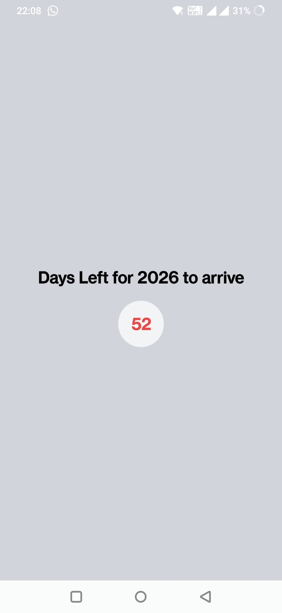
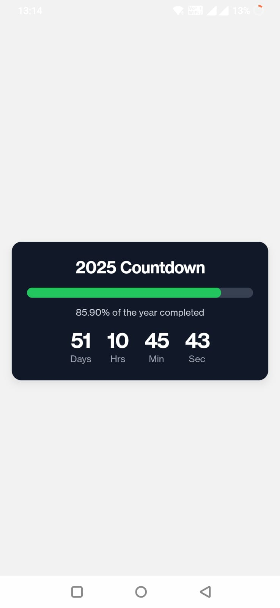
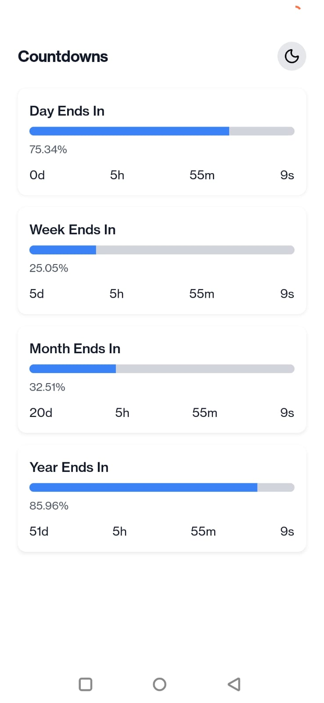
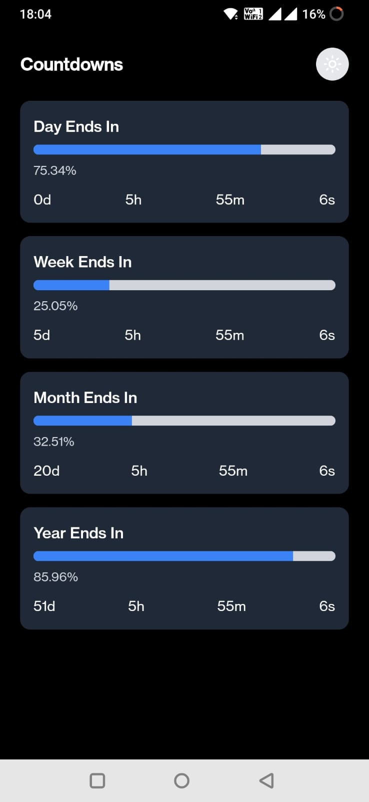

# Expo app with Nativewind

## Building a very simple year lapse UX application on Expo(RN) + Nativewind and building it to get apk

### UX
- There are 3 versions of UX.
  
#### V1 - Display Days left for current year to complete
</img>

#### V2 - Display a timer to indicate time left for current year to complete
</img>


#### V3 - Display a timer to indicate time left for current day, week, month, year to complete with a Confetti celebration with a light and dark mode.
</img>
</img>


## Create an expo repo without the new file navigation but with nativewind
- npm install -g create-expo-stack rn-new
- npx rn-new --nativewind
  
## Create expo app with file navigatin and nativewind
- npx create-expo-app@latest . (current folder must be empty)
- npm run reset-project
- npm install nativewind tailwindcss@^3.4.17
- [Follow These Docs Steps from Nativewind](https://www.nativewind.dev/docs/getting-started/installation)
- npx tailwindcss init

## Using Icons for dark and light mode

- import { Moon, Sun } from "lucide-react-native";
- <Sun size={20} color="white" />  | <Moon size={20} color="black" />


## Using ConfettiCannon to show celebration

- import ConfettiCannon from "react-native-confetti-cannon";

## Storing User Preferences of dark and light mode
- expo-secure-store
```tsx
// npx expo install expo-secure-store

//utils
import * as SecureStore from "expo-secure-store";

export async function saveTheme(value: "light" | "dark") {
  await SecureStore.setItemAsync("theme", value);
}

export async function loadTheme() {
  return await SecureStore.getItemAsync("theme");
}


// Main file
 const [hydrated, setHydrated] = useState(false);
// Load theme once
  useEffect(() => {
    (async () => {
      const storedTheme = await loadTheme();
      if (storedTheme === "dark") setDark(true);
      setHydrated(true);
    })();
  }, []);

  // Toggle theme and save
  const toggleDark = async () => {
    const next = !dark;
    setDark(next);
    await saveTheme(next ? "dark" : "light");
  };

 if (!hydrated) return <View className="flex-1 bg-black" />;
<TouchableOpacity
    onPress={toggleDark}
    className="p-2 rounded-full bg-gray-200 dark:bg-gray-700"
  >
    {dark ? <Sun size={20} color="white" /> : <Moon size={20} color="black" />}
  </TouchableOpacity>
</View>

```

- expo-storage
```tsx
import { Storage } from 'expo-storage';

export async function saveTheme(theme: string) {
  await Storage.setItem({ key: "theme", value: theme });
}

export async function loadTheme() {
  return await Storage.getItem({ key: "theme" });
}

```

- expo-mmkv
- async storage(not built in expo) - slow/not encrypted
```tsx

// expo install @react-native-async-storage/async-storage
import AsyncStorage from "@react-native-async-storage/async-storage";
await AsyncStorage.getItem("theme");
await AsyncStorage.setItem("theme", newTheme);
```


## Running using expo dev client if your app has a native component like Map
- we cannot use expo go anymore to run our app as its map which is a native component so we need to build it.
- Also if you want to do debugging on your phone either connect it using usb debuggign or wireless debugging using adb command
- In android/app/src/main/AndroidManifest.xml:
- <meta-data
  android:name="com.google.android.geo.API_KEY"
  android:value="YOUR_GOOGLE_MAPS_KEY_HERE"/>

- [Google Maps API](https://console.cloud.google.com/google/maps-apis)


- adb devices, adb connect <ip:port>, adb pair <ip:port>
- In app.json add  "scheme": "myapp",
- npx expo prebuild 
- npx expo run:android --device | the --device flag is used to build on your phone rather than emulator
- npx expo start --dev-client | if you already have the dev client installed

- **Note-** To avoid all this setup use expo-map

## To run expo GO again after running expo dev
1️⃣ Uninstall the Dev Client from your phone

The custom dev client overrides the QR scanner and prevents Expo Go from opening your project.

Go to Settings → Apps → YourApp → Uninstall

2️⃣ Install Expo Go (fresh install)

Download from Play Store:

Expo Go → install clean, new version.

3️⃣ Make sure your project is NOT prebuilt

If your project contains native folders:

/android
/ios


❌ Expo Go cannot load prebuilt/native projects.

👉 Delete both folders manually:

rm -rf android ios


Then clear everything:

npx expo start --clear

4️⃣ Install expo-maps

Expo Maps works with Expo Go starting SDK 51.

npx expo install expo-maps

5️⃣ Start the project in Expo Go

Run:

npx expo start

Expo Go now fully supports expo-maps.
## Building for App store

#### Set up EAS (Expo Application Services)
- npm install -g eas-cli
- eas login
- eas build:configure

#### Android APK (for direct install)
- eas build -p android --profile preview
- eas build -p ios --profile preview

#### Local build without uploading to expo servers
- eas build -p android --profile preview --local
- ./build-android/output.apk

###### To install directly on your iPhone:

- You must have an Apple Developer account
- You’ll need to register your device or use TestFlight


## Building for local use
- npx expo prebuild
- cd android
- ./gradlew clean
- ./gradlew assembleRelease - use this to create apk
- ./gradlew assembleDebug - debug build apk which required metro to be running - dont use to create apk
- android/app/build/outputs/apk/release/app-release.apk

## Building again after some change
- npx expo prebuild --clean
- npx expo prebuild
- cd android
- ./gradlew clean
- ./gradlew assembleRelease - use this to create apk
  

#### Installation
- adb install android/app/build/outputs/apk/debug/app-debug.apk

## Questions

- can we only use hooks inside the component function?
  - Yes, React Hooks can only be used inside React function components or custom Hooks. Hooks like useState, useEffect, useContext, etc., are designed to "hook into" React's features (state, lifecycle, context) within the context of a function component's rendering cycle.
  - Hooks are incompatible with React class components. If you are using class components, you would use this.state and lifecycle methods instead of Hooks.
  - Beyond being called within function components or custom Hooks, Hooks also have other rules, such as being called at the top level of the component/Hook (not inside loops, conditions, or nested functions) and not being conditional.
  - Attempting to use a Hook outside of these specified contexts will result in an "Invalid hook call" error from React.

- Does useeffect runs after the render of before the render of the component?
  - Yes, The order is:
  1.  Component Renders: React renders the component, calculating the virtual DOM and updating the actual DOM.
  2. useEffect Executes: After the component has rendered and the browser has painted the changes to the screen, the callback function inside useEffect is executed.
  - This behavior is important because useEffect is designed for side effects, such as data fetching, subscriptions, or manually manipulating the DOM. These operations often require the component to have already rendered and be present in the DOM for them to function correctly.
  - **It's also worth noting that:**
      By default, useEffect runs after every render.
      If an empty dependency array ([]) is provided as the second argument to useEffect, the effect will only run once after the initial render (on mount). Using return of useEffect you can also do the cleanup for timeouts or intervals or other cleanups.
      If a dependency array with specific values is provided, the effect will re-run only when those values change.
