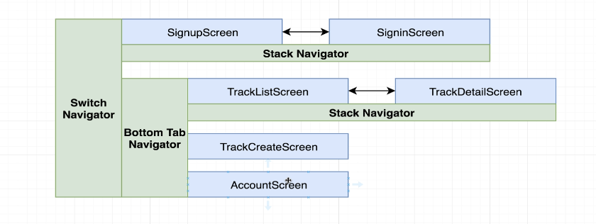

# Track App uses

## Converting Expo App.tsx project to expo-router
- npx expo install expo-router

In app.json / app.config.json
```json
{
  "expo": {
    "plugins": ["expo-router"]
  }
}
```
- create app/index.tsx in root
- convert App.tsx to expo router entry
- Replace everything in App.tsx with: import "expo-router/entry";
```js

import { Slot } from "expo-router";
import { AuthProvider } from "./context/AuthContext";

export default function Root() {
  return (
    <AuthProvider>
      <Slot />
    </AuthProvider>
  );
}

navigation.navigate("Home");

import { router } from "expo-router";

router.push("/home");


```
- npm uninstall @react-navigation/native

## Created an Expo, Nativewind but uses React Navigation not Expo Router, React-native-elements
- npx rn-new --nativewind 
- for above command to work you need to have 
- npm install -g create-expo-stack rn-new
**Note**- After the installation you need to install dependencies for React Navigation even after that if you have some error it could be due to old version for already existing dependency react-native-screens react-native-safe-area-context so install them again
**Note**- If you want expo router you have to install expo separately and then add nativewind to it separately

#### Using React Navigation / Native for older expo version
- Stack Navigator, Bottom Tab Navigator, Switch Navigator, Drawer Navigator
- npm install @react-navigation/native @react-navigation/native-stack @react-navigation/bottom-tabs  @react-navigation/drawer
- npx expo install react-native-screens react-native-gesture-handler

- There is no Switch navigator in react-navigation/native, so we use conditional rendering to handle that.


#### There could be issue using react navigation Fix:

- npx expo install react-native-screens react-native-safe-area-context
- even though these wil be present with the project but they are not of correct version for Expo SDK 54

rm -rf .expo
rm -rf node_modules
npm install
expo start --clear

import { enableScreens } from "react-native-screens"; - not required

## React Navigation as it had App.tsx as main file instead of app/index.tsx with _layout.tsx

## Below command gives old version of expo without file routing(Expo Router) capabilities | React Native CLI
- npx rn-new --nativewind (for this to work you need to have - npm install -g create-expo-stack rn-new) - uses old version of expo
- npx rn-new@latest my-expo-app --nativewind
**note** - RN CLI projects NEVER have expo in dependencies.

### Screen creation
- rnfes


### Think how screens are going to be in navigation

### App.tsx Ract Navigation Routing
```tsx
import React, { useState } from "react";
import { NavigationContainer } from "@react-navigation/native";
import { createNativeStackNavigator } from "@react-navigation/native-stack";
import { createBottomTabNavigator } from "@react-navigation/bottom-tabs";

// Auth Screens
import SignupScreen from "./src/screens/SignupScreen";
import SigninScreen from "./src/screens/SigninScreen";

// Track Screens
import TrackListScreen from "./src/screens/TrackListScreen";
import TrackDetailScreen from "./src/screens/TrackDetailScreen";
import TrackCreateScreen from "./src/screens/TrackCreateScreen";

// Account Screen
import AccountScreen from "./src/screens/AccountScreen";

import './global.css';

const Stack = createNativeStackNavigator();
const Tab = createBottomTabNavigator();

// ✅ AUTH STACK (Signup ↔ Signin)
function AuthStack() {
  return (
    <Stack.Navigator>
      <Stack.Screen
        name="Signup"
        component={SignupScreen}
        options={{ title: "Sign Up" }}
      />
      <Stack.Screen
        name="Signin"
        component={SigninScreen}
        options={{ title: "Sign In" }}
      />
    </Stack.Navigator>
  );
}

// ✅ TRACK LIST STACK (TrackList ↔ TrackDetail)
function TrackStack() {
  return (
    <Stack.Navigator>
      <Stack.Screen
        name="TrackList"
        component={TrackListScreen}
        options={{ title: "Tracks" }}
      />
      <Stack.Screen
        name="TrackDetail"
        component={TrackDetailScreen}
        options={{ title: "Track Detail" }}
      />
    </Stack.Navigator>
  );
}

// ✅ BOTTOM TABS (TrackStack + TrackCreate + Account)
function MainTabs() {
  return (
    <Tab.Navigator>
      <Tab.Screen
        name="Tracks"
        component={TrackStack}
        options={{ headerShown: false }}
      />
      <Tab.Screen
        name="TrackCreate"
        component={TrackCreateScreen}
        options={{ title: "Create Track" }}
      />
      <Tab.Screen
        name="Account"
        component={AccountScreen}
      />
    </Tab.Navigator>
  );
}

export default function App() {
  // ✅ This state acts like SwitchNavigator
  const [isLoggedIn, setIsLoggedIn] = useState(false);

  return (
    <NavigationContainer>
      {isLoggedIn ? (
        <MainTabs />
      ) : (
        <AuthStack />
      )}
    </NavigationContainer>
  );
}


```


### We can Route using buttons if expo router then we use Link
```js
// <Button title="Go to Signin" onPress={navigation.navigate("Signin")} /> // issue navigation happening on rendering of view

import { Button, StyleSheet, Text, View } from 'react-native'
import React from 'react'

const SignupScreen = ({ navigation }) => {
    return (
        <View>
            <Text>SignupScreen</Text>
            <Button title="Go to Signin" onPress={() => navigation.navigate("Signin")} />
        </View>
    )
}

export default SignupScreen

// const styles = StyleSheet.create({})
{/* <Pressable onPress={() => navigation.navigate("Signin")}>
    <Text className="text-blue-500 underline">
        Already have an account? Sign In
    </Text>
</Pressable> 

<TouchableOpacity onPress={() => navigation.navigate("Signin")}>
    <Text style={{ color: "blue" }}>Sign In</Text>
</TouchableOpacity> */}

// expo router
<Link href="/signin">
  <Text className="text-blue-500">Go to Signin</Text>
</Link>
```
- If you try to navigate from a non-existing navigation you will get error.
- For e.g., if you try to navigate from TrackListScreen to Signin it will give error navigation doesn't exist


## State Management using Context API and useReducer(Not Redux) / Jotai / Zustand / Redux


🔍 How createDataContext Works (Step-by-Step Explanation)
1️⃣ App Start / Provider Mount

When you wrap your app:

<AuthProvider>
  <AppNavigationOrScreens />
</AuthProvider>


The Provider component executes.

Inside it, useReducer(reducer, defaultValue) runs.

➡️ What Happens Inside useReducer

state gets the defaultValue (e.g. { isSignedIn: false, user: null }).

dispatch is a stable function that accepts actions like { type, payload }
and runs the reducer to produce a new state.

2️⃣ Binding Actions

The helper loops over the actions object you passed and calls each one with dispatch.

Example:

boundActions.signin = signin(dispatch);


Because signin(dispatch) returned a function like:

(credentials) => { ... }


boundActions.signin is now a callable function that components can use.

✅ These boundActions effectively close over dispatch,
so actions can dispatch reducer actions internally.

3️⃣ Provider Value

The Context.Provider value becomes:

{
  state,
  signin: boundActions.signin,
  signout: boundActions.signout
}


Any descendant component that calls:

const { state, signin } = useContext(AuthContext);


gets both the state and the action functions.

4️⃣ Component Triggers Action

Example in a screen component:

const { state, signin } = useContext(AuthContext);

// On button press:
signin({ email, password });


When signin() is called:

The action code runs (can be async),

Performs side-effects (e.g., API call),

Then calls dispatch({ type: 'signin', payload: user }) when ready.

5️⃣ Reducer Updates State

dispatch invokes:

authReducer(currentState, action)


The reducer returns a new state object (immutable pattern).

React schedules a re-render of all components that consume this context.

✅ Components re-render with the new state
(e.g. { isSignedIn: true }), so the UI updates automatically.

💡 Why This Pattern Is Useful
🔁 Familiarity

It follows a Redux-like structure — dispatch, reducer, actions —
so it’s easy to reason about state transitions.

🧩 Separation of Concerns

Reducer → handles how state changes.

Actions → handle side-effects and call dispatch.

⚙️ Scalable

Easily create more contexts (like TrackContext, SettingsContext)
without repeating logic — just reuse createDataContext.

🧱 No External Dependency

All built using built-in React APIs (useReducer, useContext) — no Redux required.

⚖️ Comparison: useReducer vs Plain useState
Feature	useState Context	useReducer Context
When to use	Simple state (few fields, direct updates)	Complex state or multiple actions
How updates happen	Directly with setState()	Through dispatch({ type, payload })
Code Example	const [user, setUser] = useState(null)	dispatch({ type: 'signin', payload: user })
Best for	Small, isolated updates	Organized, scalable state management
Pattern	Simple setter-based	Redux-like (centralized logic)
✅ Plain Context Example
const [user, setUser] = useState(null);
const signIn = (user) => setUser(user);


Great for trivial logic.

✅ Reducer-based Example
dispatch({ type: 'signin', payload: user });


Better when you have many related actions or complex updates
(e.g., resetting multiple fields, handling errors, etc.).

## Making requests axios
axios.create({baseURL:<url>, headers: { "Content-Type": "application/json"}}) -> returns a new Axios instance similar to axios which is a default instance

axios.get(url, config)
axios.post(url, data, config)

trackerApi.interceptors.request.use(
  async (config) => {
    const token = "your-auth-token"; // or from SecureStore/AsyncStorage
    if (token) {
      config.headers.Authorization = `Bearer ${token}`;
    }
    return config;
  },
  (error) => Promise.reject(error)
);

## Storing JWT on local storage - Async Storage

| Library                                       | Description                                                           | Common Functions                                                                                      |
| --------------------------------------------- | --------------------------------------------------------------------- | ----------------------------------------------------------------------------------------------------- |
| **expo-secure-store**                         | Secure, encrypted key–value storage for sensitive data (like tokens). | `setItemAsync(key, value)`, `getItemAsync(key)`, `deleteItemAsync(key)`                               |
| **react-native-mmkv**                         | Extremely fast, synchronous key–value storage (optionally encrypted). | `set(key, value)`, `getString(key)`, `getBoolean(key)`, `getNumber(key)`, `delete(key)`, `clearAll()` |
| **expo-file-system**                          | Lets you read/write entire files, good for JSON or media.             | `writeAsStringAsync(uri, data)`, `readAsStringAsync(uri)`, `deleteAsync(uri)`, `getInfoAsync(uri)`    |
| **expo-sqlite**                               | Lightweight SQL database for structured data.                         | `openDatabase(name)`, then `db.transaction(tx => tx.executeSql(query, params, success, error))`       |
| **@react-native-async-storage/async-storage** | Simple, async key–value storage for general app data (non-encrypted). | `setItem(key, value)`, `getItem(key)`, `removeItem(key)`, `multiSet()`, `multiGet()`, `clear()`       |


```js
import AsyncStorage from '@react-native-async-storage/async-storage';

export async function saveUserToken(token) {
  try {
    await AsyncStorage.setItem('userToken', token);
    console.log('Token saved!');
  } catch (e) {
    console.error('Failed to save token:', e);
  }
}

export async function getUserToken() {
  try {
    const token = await AsyncStorage.getItem('userToken');
    return token !== null ? token : null;
  } catch (e) {
    console.error('Failed to fetch token:', e);
    return null;
  }
}

export async function removeUserToken() {
  try {
    await AsyncStorage.removeItem('userToken');
  } catch (e) {
    console.error('Failed to remove token:', e);
  }
}


```

## State Management using Reducer
# 🧠 What Does a Reducer Require?

A **reducer** in React (and Redux-style state management) requires **3 key things** 👇  

---

## 1. ⚙️ Current State
The **current snapshot** of your data before any change.  
It’s automatically provided by React when you call `dispatch()`.

**Example:**
```js
const [state, dispatch] = useReducer(reducer, { count: 0 });
Here, state starts as { count: 0 }, and each time you dispatch, the current state is passed to the reducer.

2. 🎯 Action Object
An object describing what happened.
Usually includes:

A type (required) → describes the intent of the update

A payload (optional) → carries extra data needed for the update

Example:

js
Copy code
dispatch({ type: 'increment', payload: 2 });
3. 🧩 A Pure Reducer Function
A pure function that takes (state, action) and returns a new state.
It must not mutate the existing state directly.

Example:

js
Copy code
function counterReducer(state, action) {
  switch (action.type) {
    case 'increment':
      return { ...state, count: state.count + action.payload };
    case 'decrement':
      return { ...state, count: state.count - 1 };
    default:
      return state; // Always return something
  }
}
🌀 Reducer Signature
ts
Copy code
(state: StateType, action: { type: string, payload?: any }) => StateType
✅ Summary
Requirement	Description
State	Current data snapshot
Action	Object describing what to change
Pure Reducer	Function that returns a new state based on the action


  How Context API Fits with Reducers

When you combine **React Context** + **useReducer**, you get a **lightweight global state management system** — similar to Redux, but built entirely with React’s native APIs.

Let’s break down how they work **together step-by-step** 👇

---

## 1. 🏗️ Create a Context
The **Context** provides a shared “store” that can be accessed anywhere in the component tree.

```js
import React from "react";

const AuthContext = React.createContext();
export default AuthContext;

```
This context acts like a global event bus that allows you to share data (like authentication state) across components without prop drilling.

2. ⚙️ Create a Reducer
The reducer defines how the state changes based on actions.

js
Copy code
function authReducer(state, action) {
  switch (action.type) {
    case "signin":
      return { ...state, isSignedIn: true, user: action.payload };
    case "signout":
      return { ...state, isSignedIn: false, user: null };
    default:
      return state;
  }
}
3. 🧠 Create a Provider Component
The Provider combines the reducer and context — it gives all child components access to the state and actions.

js
Copy code
import React, { useReducer } from "react";
import AuthContext from "./AuthContext";

export const AuthProvider = ({ children }) => {
  const [state, dispatch] = useReducer(authReducer, {
    isSignedIn: false,
    user: null,
  });

  const signin = (user) => dispatch({ type: "signin", payload: user });
  const signout = () => dispatch({ type: "signout" });

  return (
    <AuthContext.Provider value={{ state, signin, signout }}>
      {children}
    </AuthContext.Provider>
  );
};
✅ useReducer manages complex state updates

✅ AuthContext.Provider shares state and actions with the entire app

4. 🌍 Wrap the App with the Provider
The Provider wraps your app, giving access to AuthContext anywhere inside.

js
Copy code
<AuthProvider>
  <AppNavigation />
</AuthProvider>
5. 🧩 Consume Context Anywhere
Now you can access global state and dispatch actions using useContext.

js
Copy code
import React, { useContext } from "react";
import { View, Button, Text } from "react-native";
import AuthContext from "../context/AuthContext";

export default function SignupScreen() {
  const { state, signin, signout } = useContext(AuthContext);

  return (
    <View>
      <Text>{state.isSignedIn ? "Signed In" : "Not Signed In"}</Text>
      <Button title="Sign In" onPress={() => signin({ name: "Nishant" })} />
      <Button title="Sign Out" onPress={signout} />
    </View>
  );
}
🔄 The Flow
App starts → Provider sets initial state.

Component calls an action → dispatch sends { type, payload } to reducer.

Reducer runs → returns a new state.

Context Provider updates → re-renders subscribers with new data.


### error message cleanup


```js
useEffect(() => {
         const unsubscribe = navigation.addListener("focus", () => {
             clearErrorMessage();
         });
 
         return unsubscribe;
     }, [navigation]); 


 useFocusEffect(
        React.useCallback(() => {
            clearErrorMessage();
        }, [])
    )    
```
 Every time I open this screen, wipe the error message.
Don’t recreate the function unnecessarily.
Only run it when the screen comes into focus.


### Maps

| Use Case                                 | Best Library                           |
| ---------------------------------------- | -------------------------------------- |
| Simple maps, 1–20 markers                | **react-native-maps**                  |
| Many markers, offline maps, custom tiles | **Mapbox GL**                          |
| Want web + mobile same code              | **react-native-maps** or **Expo Maps** |
| Need extreme performance                 | **Native Google Maps SDK**             |

- npx expo install react-native-maps

#### Basic Usage

```jsx
import MapView, { Marker } from 'react-native-maps';
import { View } from 'react-native';

export default function MyMap() {
  return (
    <View style={{ flex: 1 }}>
      <MapView
        style={{ flex: 1 }}
        initialRegion={{
          latitude: 28.6139,
          longitude: 77.2090,
          latitudeDelta: 0.01,
          longitudeDelta: 0.01,
        }}
      >
        <Marker
          coordinate={{ latitude: 28.6139, longitude: 77.2090 }}
          title="New Delhi"
          description="Marker example"
        />
      </MapView>
    </View>
  );
}

```

##### Tracking User Location
```js
<MapView
  showsUserLocation
  followsUserLocation
  showsMyLocationButton
/>
```

##### Custom Marker

```js

<Marker coordinate={coords}>
  <Image source={require('../assets/pin.png')} style={{ width: 40, height: 40 }} />
</Marker>
```


#####  Drawing Route

```js
<Polyline
  coordinates={[
    { latitude: 28.61, longitude: 77.20 },
    { latitude: 28.62, longitude: 77.25 },
  ]}
  strokeWidth={4}
  strokeColor="blue"
/>
```
### Running App
- we cannot use expo go anymore to run our app as its map which is a native component so we need to build it.
- In app.json add  "scheme": "myapp",
- npx expo prebuild 
- npx expo run:android
- npx expo start --dev-client

- to use map get google map sdk api key and then add to manifest.xml file or add it to app.json which automatically adds it to manifest file.
- android/app/src/main/AndroidManifest.xml
<meta-data
  android:name="com.google.android.geo.API_KEY"
  android:value="YOUR_KEY_HERE" />

```json
// app.json

"android": {
  "config": {
    "googleMaps": {
      "apiKey": "YOUR_API_KEY"
    }
  }
}
```